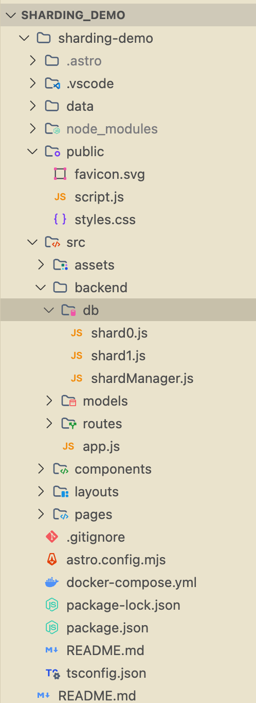

# 0.10. Temas Individuales por Integrante - Parte 2 (Informes)
- [Volver al índice](/0/0.md)

## Integrantes 01: Rodrigo De los Ríos  

### Sharding y Particionado Horizontal para Escalabilidad

#### Introducción

En el contexto actual de aplicaciones web de gran escala, la gestión eficiente de grandes volúmenes de datos se ha convertido en un desafío crítico. El **sharding** o **particionado horizontal** emerge como una solución fundamental para abordar los límites de escalabilidad en bases de datos tradicionales.

#### Marco Teórico

##### Definición de Sharding

El **sharding** es una técnica de escalabilidad horizontal que consiste en dividir una base de datos en fragmentos más pequeños llamados **shards**. Cada shard contiene un subconjunto de los datos totales y se almacena en servidores independientes, permitiendo el procesamiento paralelo de consultas y operaciones de escritura.

A diferencia del particionado vertical, que divide las tablas por columnas, el **particionado horizontal divide los datos por filas o registros completos**, utilizando criterios como identificadores de usuario, ubicación geográfica o rangos de fechas.


##### Fundamentos Técnicos

El sharding se basa en los siguientes principios:

- **Distribución de datos**: Los registros se distribuyen entre múltiples nodos según una función de particionado
- **Paralelización**: Las consultas pueden ejecutarse simultáneamente en múltiples shards
- **Independencia**: Cada shard opera como una unidad autónoma
- **Escalabilidad**: Se pueden agregar nuevos shards dinámicamente

#### Análisis Comparativo

##### Estrategias de Escalabilidad

| Estrategia | Descripción | Ventajas | Limitaciones |
|------------|-------------|----------|--------------|
| **Escalado Vertical** | Mejora de hardware en un solo nodo | Simplicidad de implementación | Límite físico del hardware |
| **Replicación** | Copias de datos entre nodos | Mejora en consultas de lectura | No optimiza escrituras |
| **Sharding** | División horizontal de datos | Escalabilidad ilimitada | Complejidad arquitectónica |


##### Ventajas del Sharding

- **Escalabilidad horizontal**: Capacidad de agregar recursos de forma dinámica
- **Rendimiento mejorado**: Reducción de latencia mediante distribución de carga
- **Tolerancia a fallos**: Aislamiento de errores por shard
- **Optimización de recursos**: Mejor utilización del hardware disponible

##### Desafíos y Limitaciones

- **Complejidad arquitectónica**: Requiere diseño cuidadoso de la estrategia de particionado
- **Consultas distribuidas**: Dificultad para realizar joins y agregaciones globales
- **Balanceamiento de carga**: Necesidad de redistribuir datos ante cambios en patrones de uso
- **Consistencia**: Mantenimiento de integridad referencial entre shards


#### Casos de Uso en la Industria

##### Aplicaciones Reales

- **Redes Sociales**: Facebook y Twitter utilizan sharding basado en ID de usuario
- **E-commerce**: Amazon implementa particionado por categoría de producto y región
- **Streaming**: Netflix emplea sharding geográfico para optimizar la entrega de contenido
- **Gaming**: Plataformas como Steam utilizan sharding por región y servidor


##### Criterios de Particionado

Los criterios más comunes para el sharding incluyen:

- **Hash-based**: Distribución basada en funciones hash del ID
- **Range-based**: Particionado por rangos de valores
- **Directory-based**: Uso de un servicio de directorio para mapear datos
- **Geographic**: Distribución basada en ubicación geográfica

#### Implementación Práctica

##### Arquitectura del Sistema Demo

Para demostrar los conceptos teóricos, se desarrolló un sistema de demostración con las siguientes características:

- **Backend**: Node.js con Express.js
- **Base de datos**: MongoDB con 2 shards independientes
- **Containerización**: Docker Compose para orquestación
- **Interfaz**: Frontend web para interacción con el usuario



##### Lógica de Enrutamiento

El sistema implementa una estrategia de sharding basada en hash simple:

```javascript
function getShard(userId) {
    return userId % 2 === 0 ? shard0 : shard1;
}
```

Esta función determina el shard destino basándose en la paridad del ID de usuario, garantizando una distribución equilibrada.

##### Componentes del Sistema

###### Configuración de Docker

```yaml
version: '3.8'
services:
  shard0:
    image: mongo:latest
    container_name: shard0
    ports:
      - "27017:27017"
    volumes:
      - ./data/shard0:/data/db

  shard1:
    image: mongo:latest
    container_name: shard1
    ports:
      - "27018:27017"
    volumes:
      - ./data/shard1:/data/db
```

###### Backend API

El backend expone los siguientes endpoints:

- `POST /posts`: Creación de nuevos posts
- `GET /posts/:userId`: Consulta de posts por usuario
- `GET /stats`: Estadísticas de distribución por shard
- `POST /simulate`: Simulación de carga con datos aleatorios

##### Interfaz de Usuario

La interfaz web proporciona:

- Formulario para creación de posts
- Buscador de posts por ID de usuario
- Generador de datos de prueba
- Visualizador de estadísticas de distribución


#### Resultados y Análisis

##### Métricas de Rendimiento

Durante las pruebas realizadas, se obtuvieron los siguientes resultados:

**Simulación con 100 posts aleatorios:**
- **Shard 0**: 51 posts (51%)
- **Shard 1**: 49 posts (49%)

**Prueba de carga extendida:**
- **Shard 0**: 240 posts (46.7%)
- **Shard 1**: 273 posts (53.3%)


##### Análisis de Distribución

Los resultados demuestran una distribución relativamente equilibrada de los datos entre shards, con una variación menor al 7% en el caso de carga extendida. Esta distribución es aceptable para un sistema de demostración y valida la efectividad del algoritmo de particionado implementado.

##### Consideraciones de Escalabilidad

El sistema demostró capacidad para:

- Manejo simultáneo de múltiples operaciones de escritura
- Consultas independientes por shard
- Generación de estadísticas agregadas
- Simulación de carga realista

#### Instrucciones de Implementación

##### Requisitos del Sistema

- Docker y Docker Compose
- Node.js (versión 14 o superior)
- Puerto 3000 disponible para el backend
- Puertos 27017 y 27018 para MongoDB

##### Pasos de Instalación

1. **Clonar el repositorio**:
   ```bash
   git clone https://github.com/RoudiOlding/sharding_demo.git
   cd sharding-demo
   cd sharding-demo
   ```

2. **Levantar los shards**:
   ```bash
   docker compose up -d
   ```

3. **Iniciar el backend**:
   ```bash
   node src/backend/app.js
   ```

4. **Iniciar el frotnend**:
   ```bash
   npm run dev
   ```
   Abrir `localhost:4321` en el navegador

**{Aquí pon una imagen de comandos de instalación, puedes buscar en Google como "docker nodejs mongodb setup"}**

##### Comandos de Mantenimiento

Para resetear el sistema y limpiar todos los datos:

```bash
docker compose down -v
rm -rf ./data
```
#### Conclusiones

##### Logros del Proyecto

Este proyecto ha demostrado exitosamente:

- La implementación práctica de conceptos de sharding
- La viabilidad de usar herramientas modernas para arquitecturas distribuidas
- La importancia del diseño cuidadoso en sistemas escalables
- La efectividad del particionado horizontal para manejar grandes volúmenes de datos

##### Lecciones Aprendidas

- El sharding manual requiere consideración cuidadosa del algoritmo de particionado
- La distribución equilibrada de datos es crucial para el rendimiento
- La monitorización continua es esencial para detectar desbalances
- La simplicidad en la implementación facilita el mantenimiento y debugging

##### Trabajo Futuro

Para extender este proyecto, se podrían implementar:

- **Rebalanceo automático**: Algoritmos para redistribuir datos dinámicamente
- **Sharding adaptativo**: Ajuste automático del número de shards
- **Monitoreo avanzado**: Métricas detalladas de rendimiento
- **Tolerancia a fallos**: Mecanismos de recuperación automática

#### Referencias

1. **MongoDB Documentation**. *Sharding*. MongoDB Inc. [https://www.mongodb.com/docs/manual/sharding/](https://www.mongodb.com/docs/manual/sharding/)

2. **Vitess Documentation**. *What is Vitess?*. The Vitess Project. [https://vitess.io/docs/overview/what-is-vitess/](https://vitess.io/docs/overview/what-is-vitess/)

3. **GeeksforGeeks**. *Scalability of System*. [https://www.geeksforgeeks.org/scalability-of-system/](https://www.geeksforgeeks.org/scalability-of-system/)

4. **Fowler, M.** *Microservices*. Martin Fowler's Website. [https://martinfowler.com/articles/microservices.html](https://martinfowler.com/articles/microservices.html)

5. **Wikipedia**. *Shard (database architecture)*. [https://en.wikipedia.org/wiki/Shard_(database_architecture)](https://en.wikipedia.org/wiki/Shard_(database_architecture))

6. **Kleppmann, M.** *Designing Data-Intensive Applications*. O'Reilly Media, 2017.

7. **Tanenbaum, A. S., & van Steen, M.** *Distributed Systems: Principles and Paradigms*. Pearson, 2016.

---

**Repositorio del Proyecto**: [https://github.com/roudidev/sharding-demo](https://github.com/RoudiOlding/sharding_demo)


## Integrantes 02: Adrián Duarte
Escriban su desarollo { incluye el enlace a repositorio externo dónde hiciste la demo }

## Integrantes 03: Alejandro Chávez

### Estrategias de Consistencia de Cache

#### Desarrollo Conceptual

En sistemas distribuidos y aplicaciones de alto rendimiento, la caché actúa como una capa intermedia entre los usuarios y el almacenamiento principal, reduciendo la latencia y mejorando los tiempos de respuesta. La consistencia de cache se refiere a la sincronización entre los datos de una cache y el almacenamiento principal. En sistemas distribuidos, mantener esta consistencia es crucial para garantizar que los clientes siempre obtengan datos actualizados, incluso cuando se realizan múltiples operaciones de lectura y escritura al mismo tiempo.

#### Estrategias principales

- Cache-Aside
    - Descripción: La aplicación gestiona directamente la cache. Primero consulta la cache y si no encuentra los datos, los busca en la base de datos principal, los almacena en cache y luego los devuelve.
    - Ventajas: Simple de implementar, eficiente para cargas de trabajo con muchas lecturas.
    - Desventajas: Puede generar inconsistencia temporal entre cache y DB.

- Write-Through
    - Descripción: Cada escritura pasa primero por la cache y luego se escribe sincrónicamente en la base de datos.
    - Ventajas: Garantiza que la cache siempre esté actualizada.
    - Desventajas: Mayor latencia en operaciones de escritura.

- Write-Behind
    - Descripción: Las escrituras se realizan primero en cache y luego, de manera asíncrona, se propagan a la base de datos.
    - Ventajas: Mejor rendimiento en escrituras.
    - Desventajas: Riesgo de pérdida de datos si falla la cache antes de propagar los cambios.

- Refresh-Ahead
    - Descripción: El sistema predice qué datos serán necesitados y los actualiza proactivamente en cache antes de que expire su TTL.
    - Ventajas: Reduce cache misses.
    - Desventajas: Complejidad en la implementación, puede consumir recursos innecesariamente.

#### Consideraciones Técnicas

Al seleccionar una estrategia de consistencia de cache, el primer aspecto técnico a evaluar es el patrón de acceso a los datos. Sistemas con un ratio de 90% lecturas y 10% escrituras se benefician claramente de estrategias como Cache-Aside o Refresh-Ahead, donde se optimiza el acceso rápido a datos frecuentemente leídos. Por el contrario, sistemas con operaciones de escritura intensivas como plataformas de transacciones financieras pueden requerir enfoques como Write-Through para garantizar consistencia inmediata.

Un segundo factor crítico es el tamaño promedio de los datos almacenados en cache. Estrategias como Write-Behind, que mantienen datos en cache por períodos prolongados, pueden ser problemáticas cuando se trabaja con grandes volúmenes de datos que superan la capacidad de la memoria cache disponible. En estos casos, es esencial implementar políticas de evicción eficientes (LRU, LFU) y considerar mecanismos de compresión.

La eficacia de cualquier estrategia depende de una configuración cuidadosa de parámetros técnicos:

- TTL (Time-To-Live):
    - Valores demasiado altos pueden servir datos obsoletos
    - Valores demasiado bajos generan excesivas recargas
    - Solución híbrida: TTL base + invalidación activa para cambios críticos

- Tamaño de Cache:
    - Debe calcularse según el working set de la aplicación
    - Monitorear continuamente la tasa de hits/misses
    - Implementar auto-scaling para cargas variables

- Políticas de Evicción:
    - LRU (Least Recently Used): Ideal para acceso temporalmente localizado
    - LFU (Least Frequently Used): Mejor para patrones de acceso estables
    - FIFO (First In First Out): Simple pero menos eficiente

#### Demo de detección de errores con Sentry
- Asegurarse de usar la rama "master"
https://github.com/AleGCC/demo-cachealejch/tree/master

## Integrantes 04: Angel Alcalá
Escriban su desarollo { incluye el enlace a repositorio externo dónde hiciste la demo }

## Integrantes 05: Erick Valderrama
Escriban su desarollo { incluye el enlace a repositorio externo dónde hiciste la demo }
