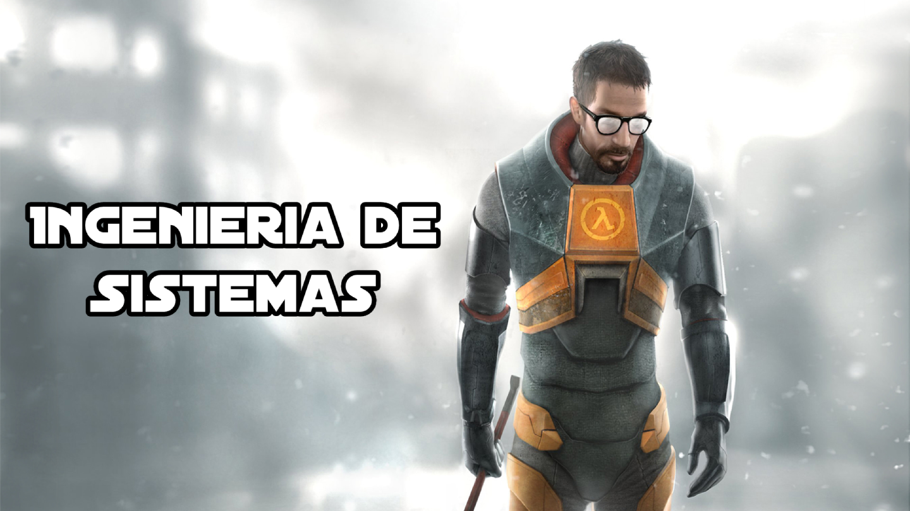

# 0.2. Integrante 2
- [Volver al índice](/0/0.md)

• Nombre: Alejandro Gabriel Chávez Candela

• Carrera: Ingeniería de Sistemas

• ¿Cuál es mi experiencia en desarrollo de software?
De momento toda mi experiencia trata de proyectos académicos y personales. En los proyectos académicos he desarrollado mayormente páginas web mientras que en mis proyectos personales he desarrollado videojuegos y algunos programas pequeños para realizar tareas específicas.

• ¿Qué tecnologías conozco o domino?
Entre las tecnologías que conozco en relación al desarrollo de software están Java, JavaScript, Sql y Python.
Otras tecnologías que domino que son más utilizadas específicamente en el ámbito de desarrollo de videojuegos son el motor de videojuegos Game Maker, el cual domino ampliamente, y Blender, software de modelado 3D, animación y renderizado. Ambas herramientas fueron de gran importancia en varios proyectos personales.

• ¿Cuál es mi expectativa del curso?
Aprender a desarrollar software con una arquitectura eficiente.

• ¿Cómo me veo en 10 años?
En 10 años me veo trabajando en un equipo de desarrollo de software, si es posible en el ámbito de los videojuegos.

