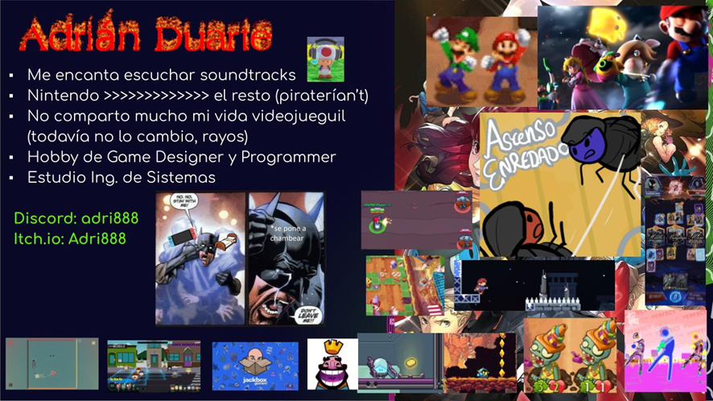

# 0.3. Integrante 3
- [Volver al índice](/0/0.md)

Nombre: Adrián
Carrera: Ingeniería de Sistemas
¿Cuál es mi experiencia en desarrollo de Software? Considero que alta; he programado en varios trabajos de la universidad, en mis prácticas pre-profesionales, en Game-Jams y para mis hobbies
¿Qué tecnologías conozco o domino? Unity, VS Code, Visual Studio, Github, Firebase, React, Arena, Excel, Arduino, Android Studio, Stencyl, entre otros
¿Cuál es mi expectativa del curso? Hacer un software chévere y completo, sobre un área que me apasione; y aprobar el curso con una nota alta
¿Cómo me veo en 10 años? Trabajando como programador y productor en una empresa (mía o de alguien más); mientras que al mismo tiempo desarrollo juegos comerciales como hobby

Échenle un vistazo: https://adri888.itch.io

 
