# 0.7. Temas Individuales por Integrante (Informes)
- [Volver al índice](/0/0.md)

Sample content for section 0.7.

## Integrantes 01: Rodrigo De los Ríos
***Arquitectura de Microservicios con Kubernetes***
### 1. Desarrollo conceptual
#### A. ¿Qué es la Arquitectura de Microservicios?  
La arquitectura de microservicios es un patrón de diseño que estructura una aplicación como una colección de servicios pequeños, independientes y débilmente acoplados. Cada microservicio se ejecuta en su propo proceso y se comunica mediante APIs bien definidas, típicamente HTTP/REST o messaging asíncrono.  
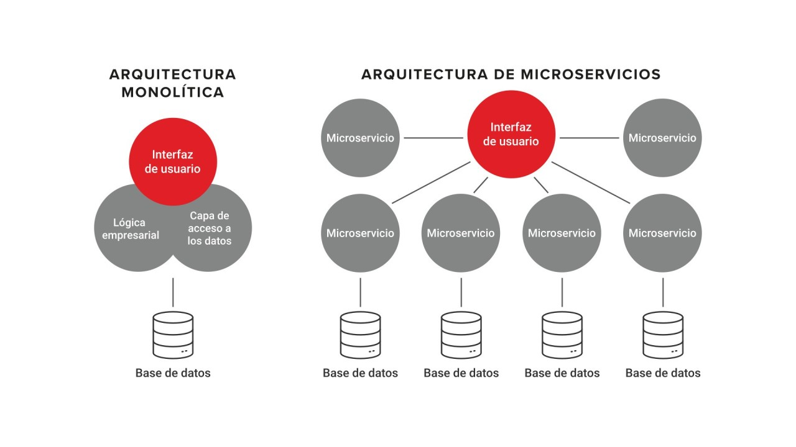  

#### B. Características principales  

- **Descentralización**: Cada servicio maneja su propia base de datos y lógica de negocio.
- **Independencia**: Los servicios pueden ser desarrollados, desplegados y escalados independientemente.
- **Responsabilidad única**: Cada microservicio tiene una función específica y bien definida.
- **Tolerancia a fallos**: El fallo de un servicio no compromete toda la aplicación.
- **Tecnología agnóstica**: Cada servicio puede usar diferentes tecnologías y lenguajes.

#### C. Importancia y utilidad
***Ventajas:***
- **Escalabilidad granular**: Escalar solo los componentes que lo necesiten.
- **Desarrollo paralelo**: Equipos independientes trabajando en diferentes servicios.
- **Despliegue independiente**: Actualizaciones sin afectar el sistema completo.
- **Resiliencia**: Aislamiento de fallos entre servicios.
- **Flexibilidad tecnológica**: Libertad de elegir la mejor tecnología para cada servicio.

***Limitaciones:***
- **Complejidad operacional**: Gestión de múltiples servicios y comunicación.
- **Latencia de red**: Comunicación entre servicios introduce overhead.
- **Consistencia de datos**: Transacciones distribuidas son complejas.
- **Monitoreo**: Necesidad de observabilidad avanzada.
- **Testing**: Pruebas de integración más complejas.

#### D. Por qué usar Microservicios  
Los microservicios resultan especialmente útiles cuando una aplicación cuenta con múltiples dominios de negocio claramente definidos, requiere que sus componentes escalen de forma independiente, involucra a diferentes equipos trabajando en distintas partes del sistema, necesita flexibilidad para adoptar nuevas tecnologías o demanda una alta disponibilidad y resiliencia.

#### E. Casos prácticos
- **Netflix**: Miles de microservicios para streaming, recomendaciones, facturación.
- **Amazon**: Servicios independientes para catálogo, pagos, envíos, reviews.
- **Spotify**: Microservicios para música, playlists, usuarios, recomendaciones.
- **Uber**: Servicios separados para usuarios, conductores, pagos, mapas.  

  

### 2. Contexto de Solución
#### A. Situación Actual: Singletone como Monolito

Actualmente, Singletone está diseñada como una aplicación monolítica con 6 módulos principales:

- **Gestión de usuarios** —— Registro, autenticación, perfiles.
- **Visualización de perfil** —- Dashboard personal y estadísticas.
- **Exploración musical** -— Búsqueda y descubrimiento.
- **Gestión de biblioteca** —- Administración de música personal.
- **Gestión de recomendaciones** —- Sistema de ML para sugerencias.
- **Gestión de planes** -— Suscripciones y pagos.

#### B. Problemas Identificados
**Escalabilidad Limitada**
El módulo de recomendaciones, al ser intensivo en machine learning, demanda más recursos que otros componentes del sistema; además, la búsqueda musical puede experimentar picos de tráfico de forma independiente, y las funciones premium presentan patrones de uso distintos, lo que refuerza la necesidad de una arquitectura flexible y escalable.

**Complejidad de Desarrollo**
Cuando equipos distintos trabajan sobre la misma base de código, pueden surgir conflictos y cuellos de botella que dificultan el desarrollo ágil. Además, los despliegues se vuelven más arriesgados, ya que un cambio puede afectar a toda la aplicación. Esta estructura monolítica también limita la posibilidad de experimentar con nuevas tecnologías, al estar todo estrechamente acoplado.

**Limitaciones Técnicas**
Contar con una base de datos central compartida por todos los módulos puede generar cuellos de botella y dificultar la independencia entre componentes. Además, utilizar una única tecnología —probablemente en un enfoque monolítico basado en un solo framework— limita la flexibilidad del sistema. Este tipo de arquitectura también suele presentar restricciones a la hora de escalar horizontalmente, afectando su capacidad de respuesta ante una alta demanda.

### C. Benficios esperados
**Para el negocio**
- Tiempo de desarrollo reducido: Equipos paralelos trabajando independientemente.
- Experimentación segura: Cambios en recomendaciones sin afectar otros servicios.
- Escalabilidad económica: Escalar solo lo que necesita más recursos.

**Para los usuarios**
- Mejor rendimiento: Servicios optimizados individualmente.
- Mayor disponibilidad: Fallos aislados no tumban toda la plataforma.
- Nuevas funcionalidades: Desarrollo más ágil de features.

**Para el equipo técnico**
- Flexibilidad tecnológica: Python para ML, Node.js para APIs, Go para performance.
- Despliegues independientes: Actualizaciones sin downtime.
- Monitoreo granular: Observabilidad por servicio.

### 3. ¿Qué es Kubernetes y cómo funciona?
Kubernetes (K8s) es una plataforma de orquestación de contenedores open-source que automatiza el despliegue, escalado y gestión de aplicaciones containerizadas. Originalmente desarrollado por Google, se basa en más de 15 años de experiencia ejecutando cargas de trabajo de producción a escala.
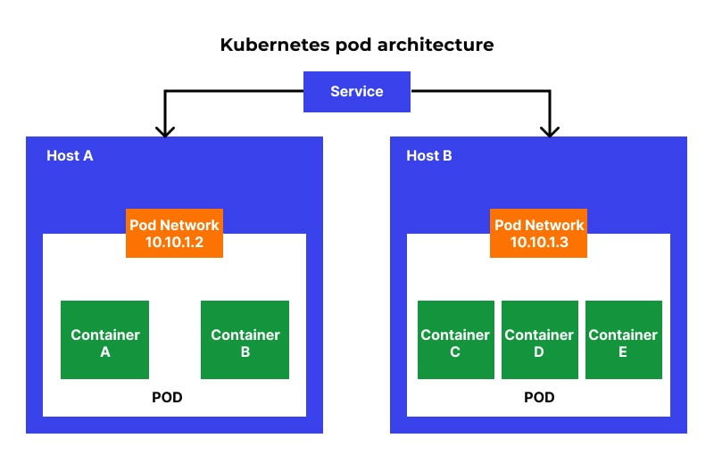

#### A. Componentes principales de Kubernetes
**Controle Plane (Panel de Control)**:
- API Server: Punto de entrada para todas las operaciones del cluster.
- etcd: Base de datos distribuida que almacena la configuración del cluster.
- Scheduler: Decide en qué nodos ejecutar los pods.
- Controller Manager: Ejecuta los controladores que regulan el estado del cluster.

**Worker nods**:
- kubelet: Agente que se ejecuta en cada nodo y gestiona los pods.
- kube-proxy: Componente de red que mantiene las reglas de red.
- Container Runtime: Motor que ejecuta los contenedores (Docker, containerd).

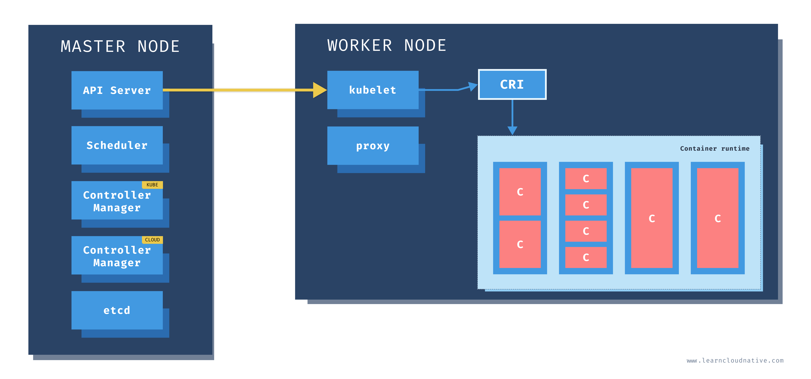

#### B. Conceptos fundamentales
**Pods:**
- Unidad más pequeña desplegable en Kubernetes.
- Puede contener uno o más contenedores que comparten red y almacenamiento.
- Los contenedores en un pod siempre se ejecutan en el mismo nodo.

**Services:**
- Abstracción que define un conjunto lógico de pods.
- Proporciona descubrimiento de servicios y balanceado de carga.
- Tipos: ClusterIP, NodePort, LoadBalancer, ExternalName.

**Deployments:**
- Gestiona el despliegue y actualización de aplicaciones.
- Asegura que el número deseado de réplicas esté ejecutándose.
- Facilita rolling updates y rollbacks.

**ConfigMaps y Secrets:**
- ConfigMaps: Almacenan datos de configuración no confidenciales.
- Secrets: Almacenan información sensible como passwords y tokens.

**Ingress:**
- Gestiona el acceso externo a los servicios del cluster.
- Proporciona balanceado de carga, terminación SSL y virtual hosting.

#### C. Cómo Kubernetes Orquesta los Microservicios
**1. Service discovery**
```
# Los servicios se registran automáticamente en DNS interno
user-service.default.svc.cluster.local
music-service.default.svc.cluster.local
``` 

**2. Load balancing**
- Kubernetes distribuye automáticamente el tráfico entre réplicas.
- Detecta pods no saludables y los excluye del balanceado.

**3. Auto-scaling**
- Horizontal Pod Autoscaler (HPA): Escala pods basado en CPU/memoria.
- Vertical Pod Autoscaler (VPA): Ajusta recursos de pods.
- Cluster Autoscaler: Añade/remueve nodos según demanda.

**4. Health checks**
- Liveness Probes: Determina si un pod está vivo
- Readiness Probes: Determina si un pod está listo para recibir tráfico
- Startup Probes: Para aplicaciones con tiempos de inicio lentos

### 4. Consideraciones técnicas
A continuación, se detalla las consideraciones que debe tener el programador antes de comenzar la implementación de Kubernetes. Este proceso incluirá tanto la descarga de Kubernetes y Docker, como verificar que el proyecto creado se encuentre corriendo.

### A. Requisitos previos
**Instalar Docker Desktop**  

Para ello nos dirigimos a la siguiente URL: [Docker Desktop](https://www.docker.com/products/docker-desktop/) y descargamos la versión compatible con nuestro sistema operativo (En caso uses macOS con chip M, descarga la opción "Apple Silicon". De lo contrario, ve por "Intel Chip").  

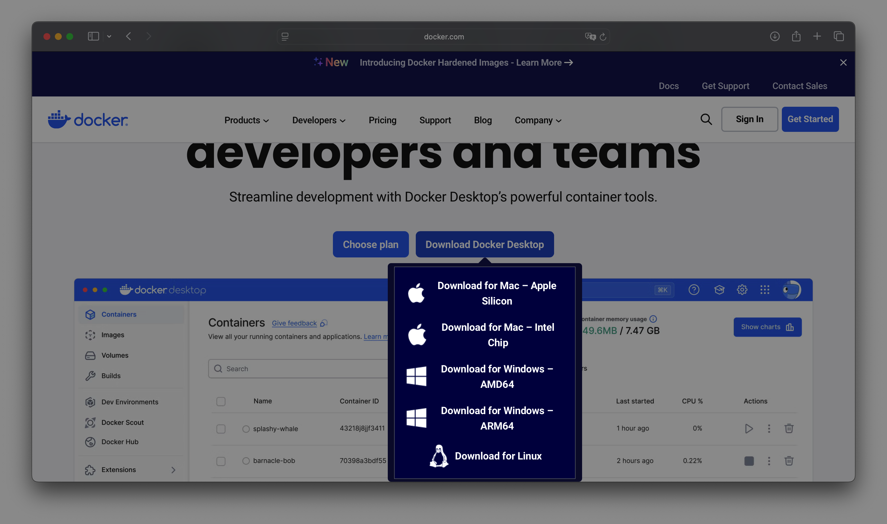

Con ello listo, abrimos la aplicación para habilitar Kubernetes a través de la ruta "Settings (ícono) -> Kubernetes -> Enable Kubernetes":  
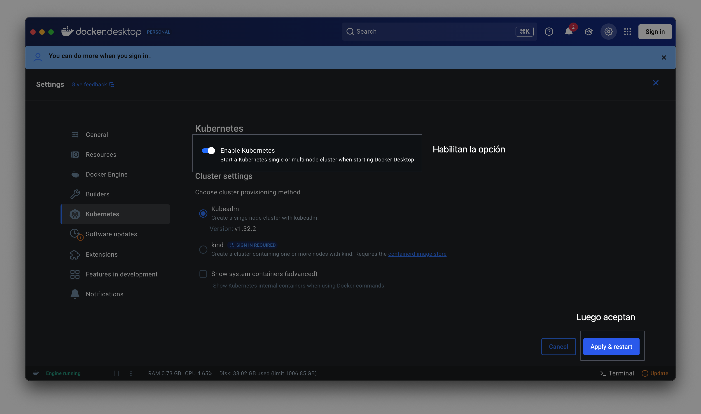
Y luego de clickear "Apply & Restart", tomará un tiempo en instalar todos los paquetes y dependencias de internet (necesitarán conexión obligatoriamente). Aunque descuiden, este proceso solo tarda la primera vez. Al final de todo les saldrá el mensaje confirmación.  
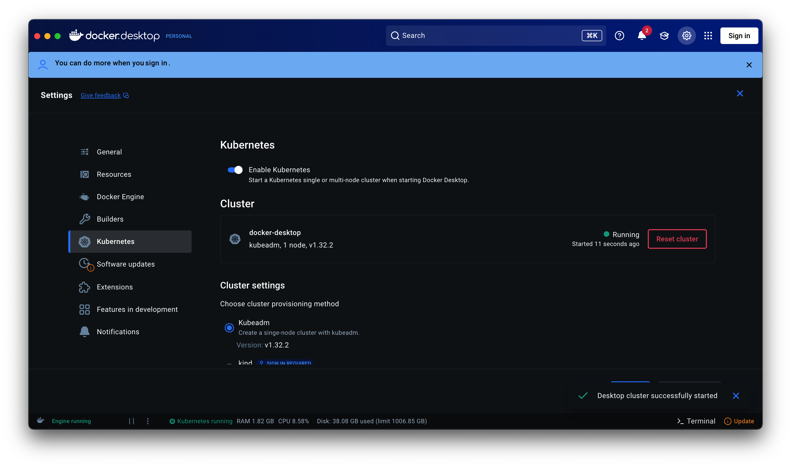

**Inslar kubectl (sino viene con Docker Desktop)**  
```
curl -LO "https://dl.k8s.io/release/$(curl -L -s https://dl.k8s.io/release/stable.txt)/bin/linux/amd64/kubectl"
```
Abran un terminal, pueden hacerlo desde vscode o la terminal básica de su sistema operativo. En mi caso, estaré usando Warp que tiene autocompletado y sugerencias con AI:  
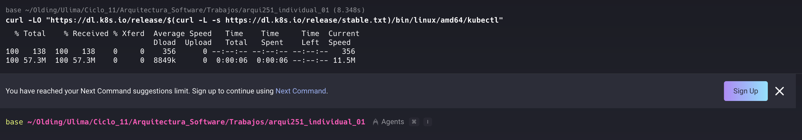

**Verificiar instalación**  
El último paso, verificar la correcta instalación de todos los componentes.  
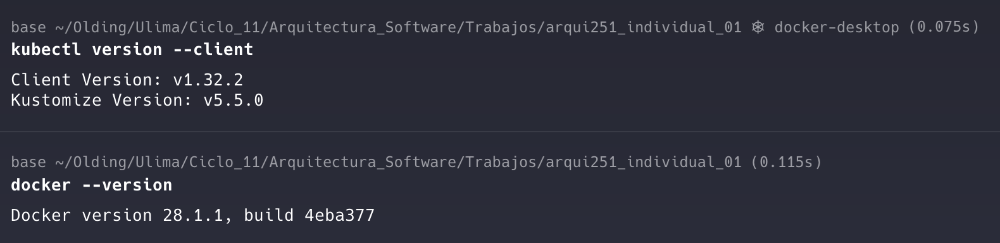

#### B. Configuración inicial
```
# Crear namespace para el proyecto
kubectl create namespace { el nombre de tu proyecto }

# Verificamos que Kubernetes esté corriendo
kubectl get nodes
```
Y este debería ser el resultado, importante tener el Docker Desktop abierto:  
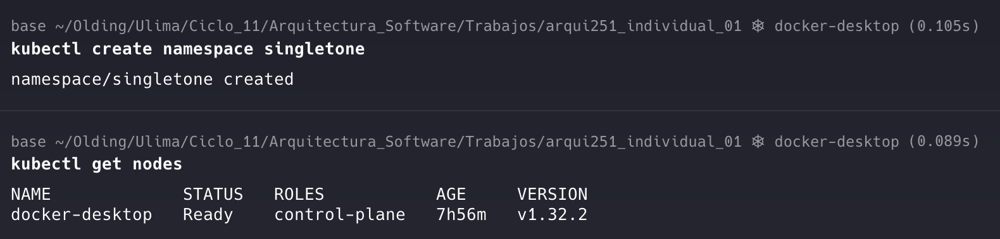

### 5. Demo técnica
Con la finalidad de demostrar la funcionlidad de Kubernetes, estaremos aplicando su uso al software "Singletone". Un software de valoración musical en el que cada usuario almacena valoraciones de álbumes musicales, siendo su principal diferenciador el que es un gestor de contenido más que una red social. En singletone, solo importa "tu" opinión.

Lo único a considerar es que por el alcance de la actividad, estaremos reduciendo las funcionlidades a una sola, así como la configuración completa de ciertas herramientas. Véase el frontend y backend que tendrán archivos más sencillos, contrario a cuando se hace un aplicativo masivo.

#### A. Estructura de Carpetas
Al momenta de manejar contenedores, es de suma importancia mantener una estructura de carpetas impecable. Pues, estaremos usando rutas al momento de establecer las configuraciones. Recomendamos esta para la demo:  
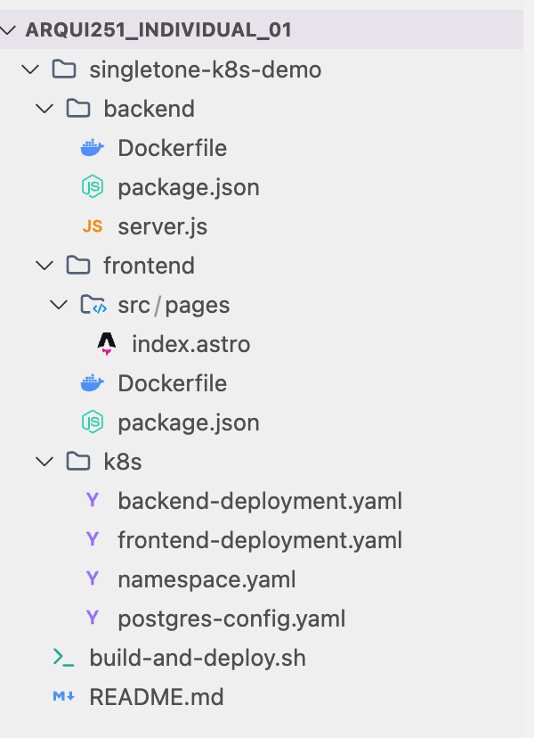

#### B. Backend
Como se ve en la carpeta, debemos de configurar 3 archivos importantes.  
**Dockerfile**  
Este nos ayudará a dockerizar el microservicio a futuro.  
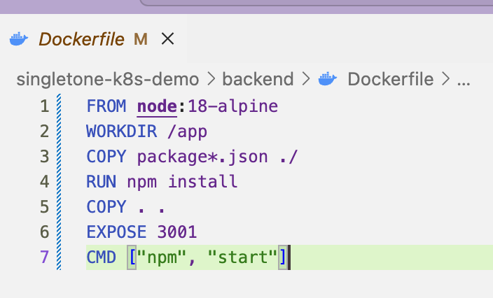

**Package.json**  
Encargado de gestionar dependencias y scripts.  
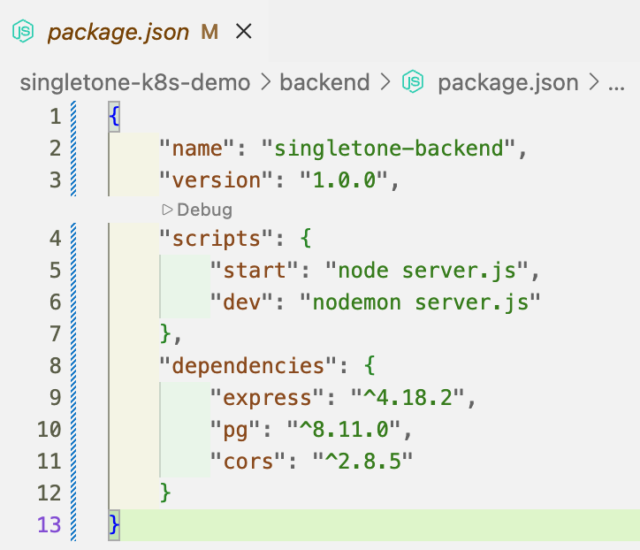

**Server.js**
Aquí configuraremos las rutas y servicios APIs que ofrecerá nuestro backend.
```
const express = require('express');
const { Pool } = require('pg');
const cors = require('cors');

const app = express();
const PORT = process.env.PORT || 3001;

// Configuración de PostgreSQL
const pool = new Pool({
    host: process.env.DB_HOST || 'postgres-service',
    port: process.env.DB_PORT || 5432,
    database: process.env.DB_NAME || 'singletone',
    user: process.env.DB_USER || 'admin',
    password: process.env.DB_PASSWORD || 'password123'
});

app.use(cors());
app.use(express.json());

// Inicializar base de datos
async function initDB() {
    try {
        await pool.query(`
        CREATE TABLE IF NOT EXISTS users (
            id SERIAL PRIMARY KEY,
            name VARCHAR(100) NOT NULL,
            email VARCHAR(100) UNIQUE NOT NULL,
            nickname VARCHAR(50) UNIQUE NOT NULL,
            plan VARCHAR(20) DEFAULT 'gratuito',
            created_at TIMESTAMP DEFAULT CURRENT_TIMESTAMP
        )
        `);
        console.log('Tabla users creada');
    } catch (err) {
        console.error('Error creando tabla:', err);
    }
}

// Rutas API
app.get('/health', (req, res) => {
    res.json({ status: 'OK', service: 'singletone-backend' });
});

app.get('/api/users', async (req, res) => {
    try {
        const result = await pool.query('SELECT * FROM users ORDER BY created_at DESC');
        res.json(result.rows);
    } catch (err) {
        console.error('Error fetching users:', err);
        res.status(500).json({ error: 'Error interno del servidor' });
    }
});

app.post('/api/users', async (req, res) => {
    const { name, email, nickname } = req.body;
    
    try {
        const result = await pool.query(
        'INSERT INTO users (name, email, nickname) VALUES ($1, $2, $3) RETURNING *',
        [name, email, nickname]
        );
        res.status(201).json(result.rows[0]);
    } catch (err) {
        console.error('Error creating user:', err);
        if (err.code === '23505') {
        res.status(400).json({ error: 'Email o nickname ya existe' });
        } else {
        res.status(500).json({ error: 'Error interno del servidor' });
        }
    }
});

setTimeout(() => {
    initDB().then(() => {
        app.listen(PORT, '0.0.0.0', () => {
        console.log(`🚀 Backend corriendo en puerto ${PORT}`);
        });
    });
}, 5000);
```

#### C. Frontend
**Dockerfile**
Mismo procedimiento.  
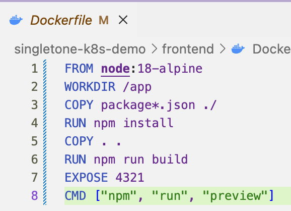

**Pacakge.json**
Mismo procedimiento.  
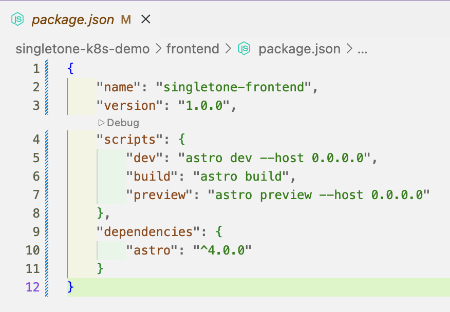

**Index.astro**  
Aquí configuramos lo que verá el usuario. Hemos adjunto la imagen del body; sin embargo, en el repositorio de la demo puedes ver el código completo.
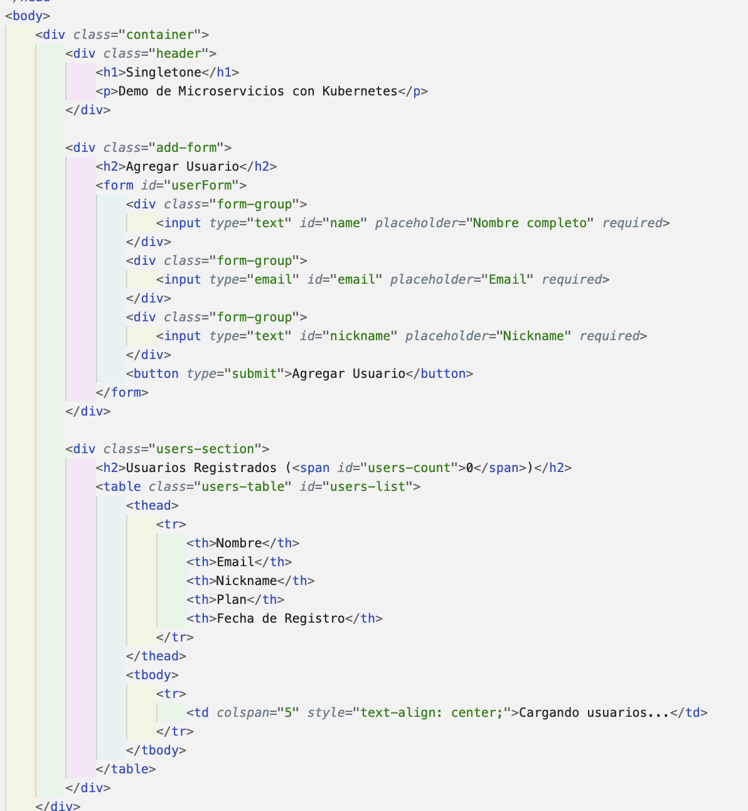

#### D. Configuración de Kubernetes
**namespace.yml**  
Este archivo es necesario para: crear el namespace singletone, donde se desplegarán todos los recursos del proyecto, permitiendo su organización y aislamiento dentro del clúster de Kubernetes.
```
apiVersion: v1
kind: Namespace
metadata:
  name: singletone
```

**postgres-config.yaml**  
Este archivo es necesario para: onfigurar y desplegar una base de datos PostgreSQL, incluyendo:
- Un ConfigMap con credenciales y nombre de la base de datos.
- Un Deployment que levanta un contenedor de PostgreSQL con persistencia efímera (emptyDir).
- Un Service que expone PostgreSQL dentro del namespace para que otros servicios lo puedan usar.

```
apiVersion: v1
kind: ConfigMap
metadata:
  name: postgres-config
  namespace: singletone
data:
  POSTGRES_DB: singletone
  POSTGRES_USER: admin
  POSTGRES_PASSWORD: password123
---
apiVersion: apps/v1
kind: Deployment
metadata:
  name: postgres
  namespace: singletone
spec:
  replicas: 1
  selector:
    matchLabels:
      app: postgres
  template:
    metadata:
      labels:
        app: postgres
    spec:
      containers:
      - name: postgres
        image: postgres:15-alpine
        ports:
        - containerPort: 5432
        envFrom:
        - configMapRef:
            name: postgres-config
        volumeMounts:
        - name: postgres-data
          mountPath: /var/lib/postgresql/data
      volumes:
      - name: postgres-data
        emptyDir: {}
---
apiVersion: v1
kind: Service
metadata:
  name: postgres-service
  namespace: singletone
spec:
  selector:
    app: postgres
  ports:
  - port: 5432
    targetPort: 5432
  type: ClusterIP
```

**backend-deployment.yaml**  
Este archivo es necesario para: desplegar el backend de la aplicación, incluyendo:  
- Un Deployment que levanta 2 réplicas del contenedor singletone-backend.
- Variables de entorno para conectarse a la base de datos PostgreSQL.
- Un Service tipo LoadBalancer para exponer el backend dentro del clúster y al exterior si es necesario.
```
apiVersion: apps/v1
kind: Deployment
metadata:
  name: backend
  namespace: singletone
spec:
  replicas: 2
  selector:
    matchLabels:
      app: backend
  template:
    metadata:
      labels:
        app: backend
    spec:
      containers:
      - name: backend
        image: singletone-backend:latest
        imagePullPolicy: Never
        ports:
        - containerPort: 3001
        env:
        - name: DB_HOST
          value: "postgres-service"
        - name: DB_NAME
          value: "singletone"
        - name: DB_USER
          value: "admin"
        - name: DB_PASSWORD
          value: "password123"
---
apiVersion: v1
kind: Service
metadata:
  name: backend-service
  namespace: singletone
spec:
  selector:
    app: backend
  ports:
  - port: 3001
    targetPort: 3001
  type: LoadBalancer
```

**frontend-deployment.yaml**  
Este archivo es necesario para: desplegar el frontend de la aplicación, incluyendo:
- Un Deployment que levanta una réplica del contenedor singletone-frontend.
- Una variable de entorno que apunta al backend.
- Un Service tipo LoadBalancer para exponer la interfaz de usuario al exterior del clúster.

```
apiVersion: apps/v1
kind: Deployment
metadata:
  name: frontend
  namespace: singletone
spec:
  replicas: 1
  selector:
    matchLabels:
      app: frontend
  template:
    metadata:
      labels:
        app: frontend
    spec:
      containers:
      - name: frontend
        image: singletone-frontend:latest
        imagePullPolicy: Never
        ports:
        - containerPort: 4321
        env:
        - name: PUBLIC_API_URL
          value: "http://backend-service:3001"
---
apiVersion: v1
kind: Service
metadata:
  name: frontend-service
  namespace: singletone
spec:
  selector:
    app: frontend
  ports:
  - port: 3000
    targetPort: 4321
  type: LoadBalancer
```

#### E. Deployment
Debemos de configurar un script que levante todos los servicios cuando los solicitemos, el mismo es: "build-and-deploy.sh" y contiene el siguiente código:
```
#!/bin/bash

echo "Construyendo imágenes Docker..."

# Build backend
cd backend
docker build -t singletone-backend:latest .
cd ..

# Build frontend
cd frontend
docker build -t singletone-frontend:latest .
cd ..

echo "Desplegando en Kubernetes..."

# Aplicar configuraciones
kubectl apply -f k8s/namespace.yaml
kubectl apply -f k8s/postgres-config.yaml
kubectl apply -f k8s/backend-deployment.yaml
kubectl apply -f k8s/frontend-deployment.yaml

echo "Esperando que los pods estén listos..."
kubectl wait --for=condition=ready pod -l app=postgres -n singletone --timeout=120s
kubectl wait --for=condition=ready pod -l app=backend -n singletone --timeout=120s
kubectl wait --for=condition=ready pod -l app=frontend -n singletone --timeout=120s

echo "Despliegue completado!"
echo "Accede a la aplicación en: http://localhost:3000"

# Mostrar estado
kubectl get pods -n singletone
kubectl get services -n singletone
```

#### F. Proceso de levantamiento
Primero debemos asegurar que docker desktop esté abierto:  
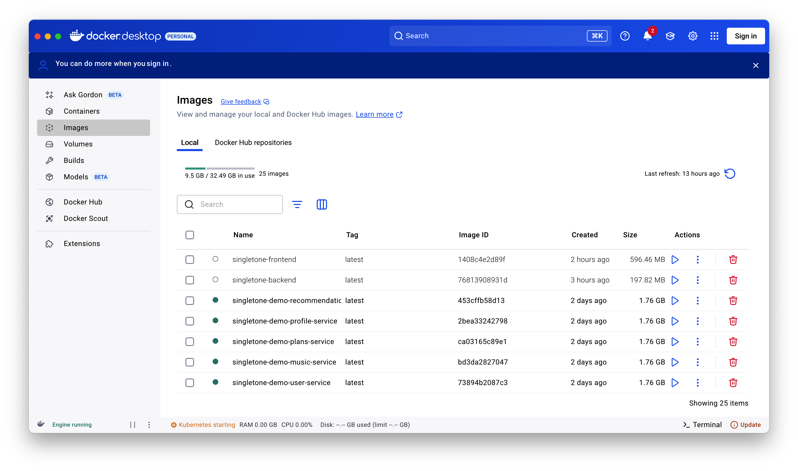

Luego, levantamos los servicios.  
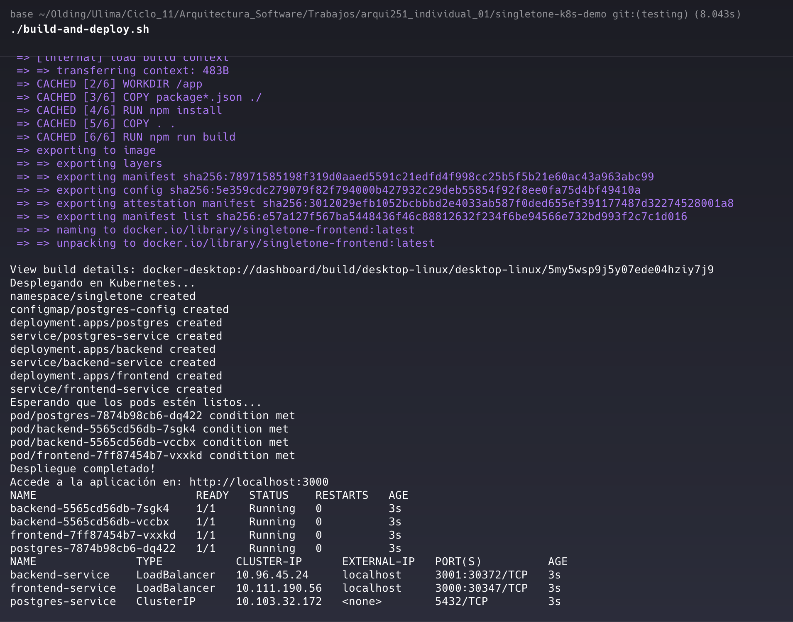

Una vez se confirme que todo esté correcto, podremos probar el pequeño aplicativo que hemos realizado.  
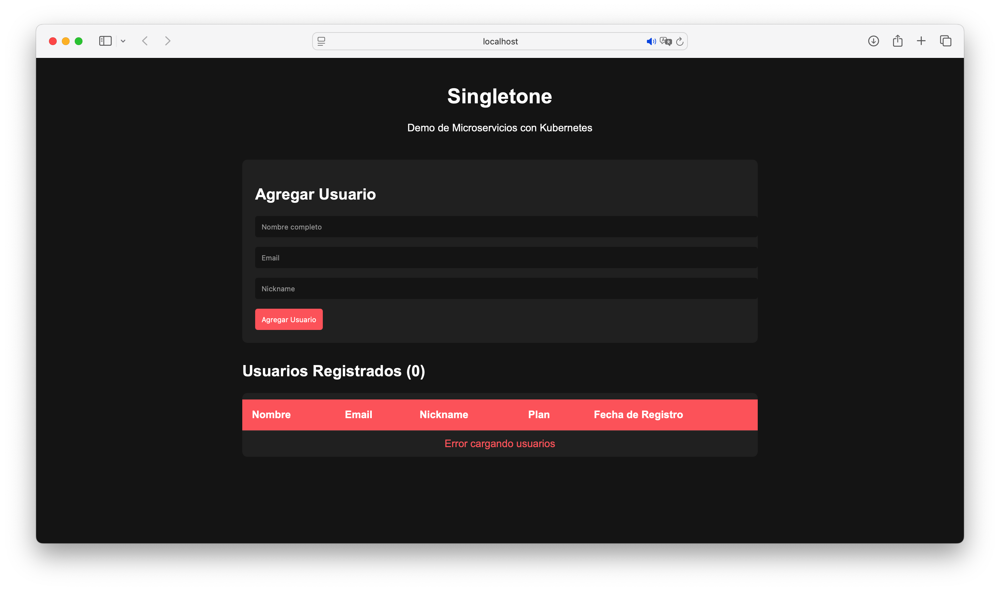

Como vemos, funciona correctamente y permite el registro de usuarios.  
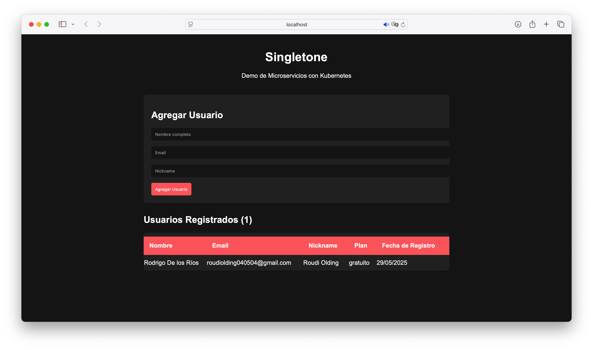

### 6. Link del repositorio
Todo lo desarrollado previamente se encuentra en el siguiente repositorio público:
[enlace a github](https://github.com/RoudiOlding/arqui251_individual_01)

## Integrante 02: Adrián Duarte
**Tema:** NoSQL - Bases de Datos de Clave / Valor

### 1. Desarrollo conceptual
Se conoce como base de datos de clave-valor, o NoSQL, a la base de datos no relacional que utiliza un método simple de clave-valor para almacenar los datos, como un conjunto de pares clave-valor en los que una clave sirve como un identificador único. Aunque está diseñado para modelos de datos específicos, este tipo de base de datos es altamente divisible y permite escalado horizontal a niveles que otros tipos de bases de datos no pueden alcanzar. Finalmente, las bases de datos NoSQL son fáciles de desarrollar, por su funcionalidad y el rendimiento a escala.
Tanto las claves como los valores pueden ser cualquier cosa, desde objetos simples hasta objetos compuestos complejos.

#### 1.1 Ventajas
Las aplicaciones procesan un gran volumen de datos de fuentes dispares, como las redes sociales, los sensores inteligentes y las bases de datos de terceros. Todos estos datos dispares no encajan perfectamente en el modelo relacional. La aplicación de estructuras tabulares puede provocar redundancia, duplicación de datos y problemas de rendimiento a escala. El NoSQL evita esos problemas gracias a su:

- Flexibilidad: Ofrecen esquemas flexibles que permiten un desarrollo más rápido y más iterativo, ideal para datos semiestructurados y no estructurados
- Escalabilidad: Están diseñadas para escalar horizontalmente usando clústeres distribuidos de hardware, en lugar de escalar añadiendo servidores caros y sólidos
- Alto rendimiento: Están optimizadas para modelos de datos y patrones de acceso específicos, permitiendo un mayor rendimiento que si intentara lograr una funcionalidad similar con bases de datos relacionales
- Altamente funcional: Proporcionan API altamente funcionales y tipos de datos que están diseñados específicamente para cada uno de sus respectivos modelos de datos

#### 1.2 Casos de uso
Se puede usar NoSQL para crear una amplia variedad de aplicaciones móviles, de Internet of Things (Internet de las cosas (IoT)), de juegos y web de alto rendimiento que proporcionan excelentes experiencias de usuario a escala. Por ejemplo:

- Administración de datos en tiempo en tiempo real: Puede ofrecer recomendaciones en tiempo real, personalización y experiencias de usuario mejoradas con bases de datos NoSQL. Por ejemplo, Disney+ ofrece su amplia biblioteca de contenido digital a más de 150 millones de suscriptores mediante la tecnología de base de datos NoSQL. Puede escalar y ofrecer funciones populares, como Seguir viendo, Mi lista y Recomendaciones personalizadas con Amazon DynamoDB
- Seguridad en la nube: Puede usar bases de datos de grafos para descubrir rápidamente relaciones complejas en sus datos. Por ejemplo, Wiz reimaginó la seguridad en la nube como un gráfico con Amazon Neptune. Wiz ayuda a sus clientes a mejorar su postura de seguridad al identificar y corregir rápidamente los riesgos más críticos. Utilizan un modelo gráfico almacenado en Amazon Neptune para descubrir la combinación tóxica de factores de riesgo que representan riesgos críticos. Los motores de riesgo de Wiz recorren el gráfico y, en cuestión de segundos, entrelazan una serie de factores de riesgo interconectados en un gráfico de seguridad
- Aplicaciones de alta disponibilidad: Las bases de datos NoSQL distribuidas son excelentes para crear aplicaciones de alta disponibilidad y baja latencia para mensajería, redes sociales, uso compartido de archivos y más. Por ejemplo, Snapchat tiene más de 290 millones de usuarios que envían miles de millones de imágenes y mensajes de video a diario. Utiliza sistemas de bases de datos NoSQL para reducir la latencia media del envío de mensajes en un 20 %

#### 1.3 Funcionamiento
Las bases de datos NoSQL utilizan una variedad de modelos de datos para acceder y administrar datos. Estos tipos de bases de datos están optimizados específicamente para aplicaciones que requieren modelos de datos flexibles, grandes volúmenes de datos y baja latencia, lo que se logra mediante la flexibilización de algunas de las restricciones de coherencia de datos en bases de datos relacionales. Existen diferencias en la implementación según el modelo de datos. Sin embargo, muchas bases de datos NoSQL utilizan Javascript Object Notation (JSON), un formato de intercambio de datos abierto que representa los datos como una colección de pares nombre-valor.

Fuentes: https://aws.amazon.com/es/nosql/, https://aws.amazon.com/es/nosql/key-value/

### 2. Consideraciones técnicas
Programa: Amazon DynamoDB
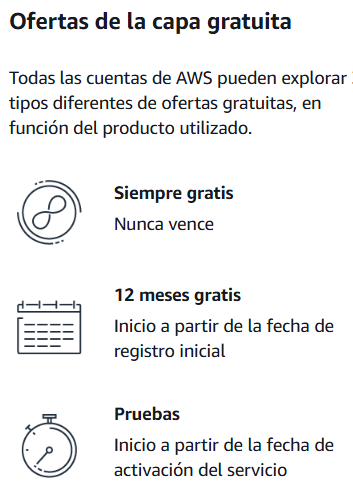

Pasos para el plan gratuito:
1. Entrar a: https://signin.aws.amazon.com/signup?request_type=register
(Si no tienes cuenta)
a. Ingresar tu correo e inventar un nombre
b. Ingresar el código de verificación enviado a tu correo
c. Crear una contraseña para tu cuenta
d. Rellenar todos los campos (nombre completo, organización, teléfono, aceptar términos y condiciones, etc)
e. Ingresar los datos de tu tarjeta
d. Confirmar tu número de teléfono y pasar el CAPTCHA
e. Elegir plan de soporte (gratuito)
f. Presionar el botón "Ir a la consola de administración de AWS"
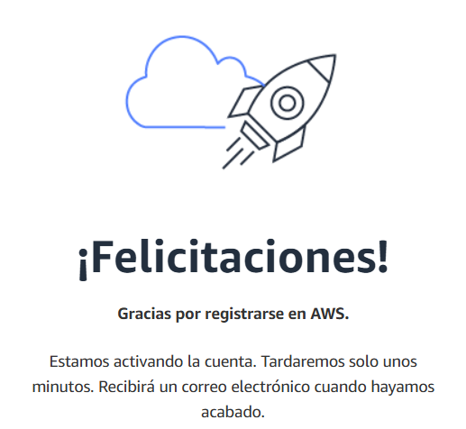
(Si tienes cuenta)
a. Presionar el botón "Sign in to an existing AWS acount"
b. Ingresar sesión por IAM o por correo
(Se seguirá la ruta del correo)
c. Presionar el botón "Sign in using root user email"
d. Ingresar usuario y contraseña
e. Ingresar código de verificación enviado al correo
2. Llegar a esta pantalla
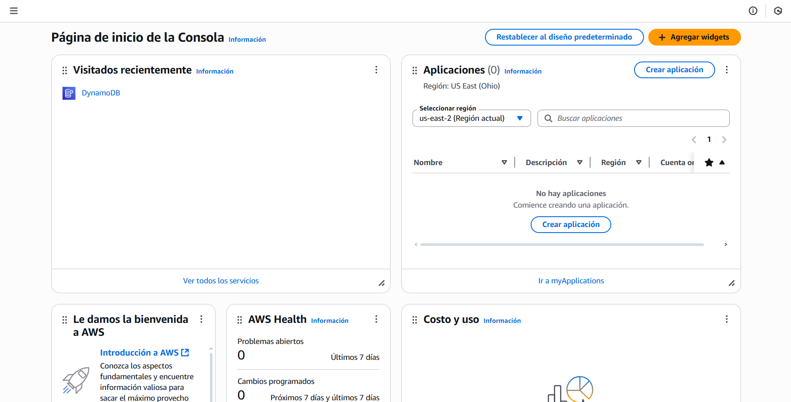
3. Presionar las 3 líneas de la esquina superior izquierda
4. Presionar el texto "Todos los servicios"
5. Presionar el texto Base de datos->"DynamoDB" (también lo puedes buscar en el buscador)
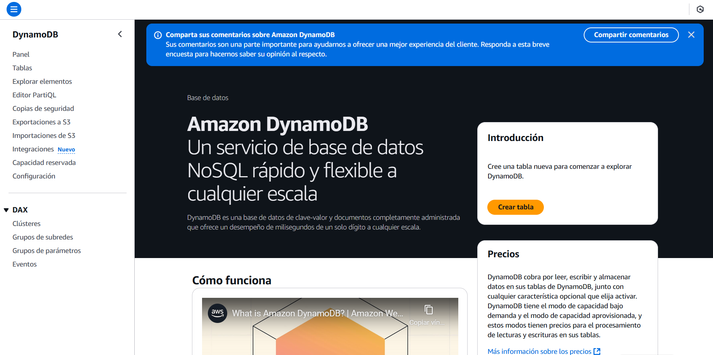
6. Presionar "Crear tabla"
7. Escribir el nombre de la tabla y el nombre de la clave de partición
8. Presionar "Crear tabla"
9. Presionar el nombre de tu tabla
10. Presionar "Acciones->Crear elemento"
11. Introducir los datos de tu elemento, mediante el botón "Agregar nuevo atributo". Por ejemplo, los siguientes:
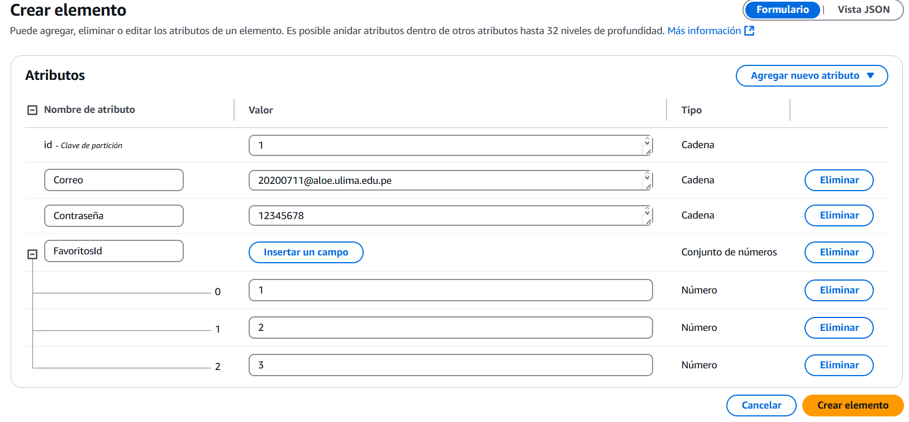
12. Presionar "Crear elemento"
13. Crear un 2do elemento, pero con distintos atributos
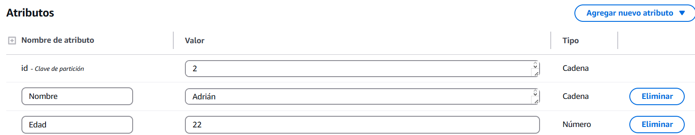
Como se puede apreciar, DynamoDB creo el 2do elemento sin ningún error. A diferencia de SQL, no necesita modificar la tabla para agregar o renombrar las columnas
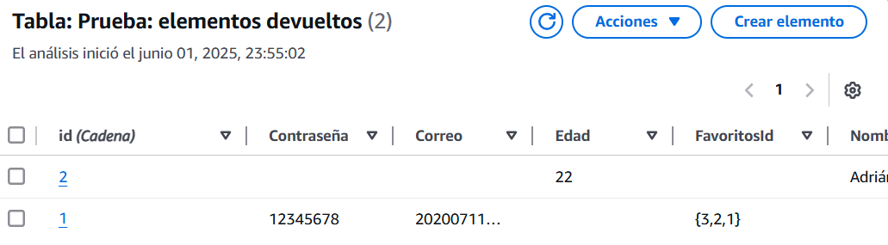


### 3. Demo (Código)
Deben presentar un escenario de aplicación y realizar una implementación simple utilizando el tema desarrollado. El código debe estar publicado en el repositorio Github del grupo.

## Integrantes 03: Alejandro Chávez

# Observabilidad y monitoreo de aplicaciones
En el desarrollo de software moderno, especialmente en entornos distribuidos y basados en microservicios, garantizar la estabilidad, el rendimiento y la rápida detección de problemas es crucial. Aquí es donde entran en juego la observabilidad y el monitoreo, dos conceptos interrelacionados pero distintos que permiten a los equipos de desarrollo y operaciones mantener sistemas confiables y eficientes.

## Monitoreo
El monitoreo se refiere al proceso de recopilar, analizar y visualizar datos sobre el comportamiento de un sistema para detectar anomalías, evaluar el rendimiento y generar alertas cuando ocurren problemas conocidos.

### Objetivos del monitoreo
- Deteción de fallos: Identificar errores a tiempo real, como por ejemplo caídas del servidor o degradación del rendimiento.
- Alertas proactivas: Identificar problemas y notificarlos antes de que los usuarios puedan verse afectados.
- Tendencia histórica: Analizar las métricas a lo largo del tiempo para facilitar la toma de decisiones
- Cumplimiento de acuerdos a nivel de servicio: Asegurar que el sistema cumple con proveer el nivel de servicio acordado.

### Tipos de monitoreo
- De infraestructura: Supervisa los recursos del sistema (CPU, memoria, disco, red, servidores).
- De aplicaciones: Supervisa el rendimiento de las aplicaciones, evaluando que estas funcionen con regularidad, buscando errores o problemas de latencia.
- De usuarios: Monitorea la experiencia del usuario final que usa el sistema.
- De logs: Recolecta y analiza registros de eventos, esto incluye cosas como solicitudes y errores junto con su información detallada.

## Observabilidad
A diferencia del monitoreo, el cual se enfoca en problemas conocidos, la observabilidad se enfoca en descubrir nuevos problemas de los cuales no se tiene registro previo, mediante el análisis de datos entrantes y salientes del sistema. Facilita la resolución de problemas, mejora el rendimiento y la confiabilidad del sistema, y permite una optimización proactiva.

La observabilidad cuenta con tres pilares fundamentales:
- Métricas: Datos numéricos que cuantifican aspectos clave de un sistema, tales como el rendimiento, uso de recursos, latencia y tasa de errores. El uso de métricas permite monitorear el estado de un sistema en el tiempo e identificar patrones y tendencias.
- Logs/Registros: Mensajes generados el sistema que describen eventos que toman lugar en este. Estos registros ayudan a comprender qué está sucediendo dentro del sistema y bajo que contexto para así identificar errores y depurar problemas.
- Trazas: Registros de eventos relacionados entre diferentes componentes de un mismo sistema, mostrando el flujo del evento a través de múltiples servicios del sistema. Las trazas permiten rastrear la raíz de un problema y entender cómo las diferentes partes de un sistema interactúan entre sí durante este evento. Especialmente útil en una arquitectura de microservicios.

## Diferencias entre monitoreo y observabilidad
|  | **Monitoreo** | **Observabilidad** |
|------------------|------------------|------------------|
Enfoque Principal | Recopilar datos para identificar anomalías en el sistema | Investigar la causa de las anomalías en el sistema
Sistemas Involucrados | Mayormente sistemas independientes | Sistemas múltiples y dispares
Nivel de trazabilidad | Limitado a un mismo sistema | Disponible cuando las señales se transmiten entre sistemas dispares
Resultados | Que error sucedió y cuando | Por qué sucedió el error y como

## Sentry
Sentry es una plataforma del tipo SaaS enfocada en la observabilidad y monitoreo, especializada en detección de errores en tiempo real de aplicaciones, ayudando a los desarrolladores a identificar la causa, frecuencia e impacto de estos. Sentry además permite monitorear el rendimiento de las aplicaciones. Sentry es compatible con una amplia gama de lenguajes de programación, por lo que es ideal para cualquier tipo de proyecto, además es utilizado por grandes empresas como Disney y Microsoft.

### Ejemplo de flujo de trabajo con Sentry
| **Paso** | **Acción** | **Resultado** |
|------------------|------------------|------------------|
1 | El usuario hace clic en un botón | Se lanza un error
2 | Sentry captura el error | El error aparece en el dashboard
3 | El equipo recibe una alerta	| Se prioriza la solución
4 | Se implementa una solución | Sentry monitorea si el error reaparece

## Consideraciones técnicas
### Requisitos básicos:
- Tener una cuenta en sentry.io
- SDK compatible con el lenguaje usado en tu proyecto
- DNS de tu proyecto en Sentry

### Instalación
Una vez que creas tu proyecto en la página de Sentry, se proporciona documentación simple y específica sobre como instalar e iniciar el servicio de Sentry en tu aplicación, dependiendo de que lenguaje de programación se este utilizando.

### Bloqueadores de anuncios y rastreadores
Cuando desplegamos una aplicación web, algunos usuarios podrían hacer uso de extensiones o navegadores especiales para bloquear anuncios y otros rastreadores, en algunos casos estos pueden dificultar el monitoreo por parte de Sentry. Para asegurarse de que la aplicación este enviando la información a Sentry con normalidad, se puede utilizar la consola del navegdor y en la pestaña "Network" buscar las solicitudes a Sentry.

## Demo de detección de errores con Sentry
https://github.com/AleGCC/arqi-demo-sentry

## Integrantes 04: Angel Alcalá

***Monorepo con NX***

## ¿Qué es un Monorepo?

Un **monorepo** (abreviatura de *monolithic repository*) es una estrategia para organizar el código fuente de múltiples proyectos o servicios dentro de un único repositorio. A diferencia de los *multirepos* (donde cada servicio tiene su propio repositorio), en un monorepo todos los servicios, librerías, herramientas y configuraciones coexisten bajo una misma estructura de carpetas.

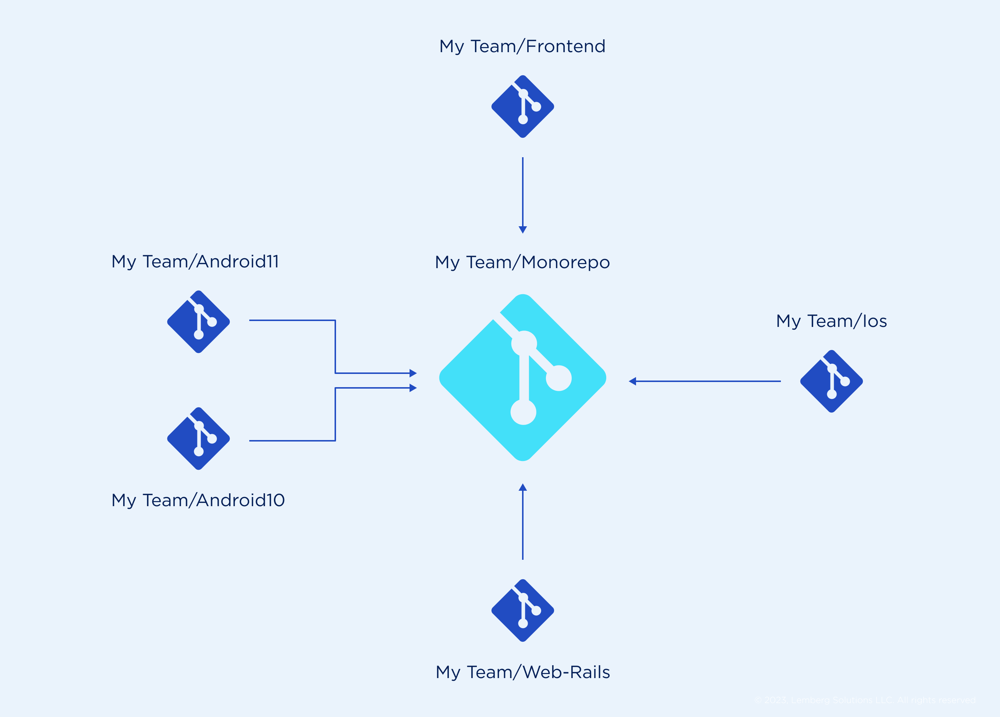  

### Características principales

- **Código centralizado**: Todo el código está en un solo repositorio.
- **Organización modular**: Cada servicio o paquete se organiza en su propio directorio.
- **Gestión compartida de dependencias**: Es posible utilizar herramientas para manejar versiones y dependencias de forma centralizada.
- **Facilidad de refactorización**: Permite hacer cambios coordinados entre múltiples servicios sin depender de múltiples repositorios.

### Ventajas

- ✅ **Coordinación entre equipos**: Los equipos pueden ver los cambios de otros servicios y colaborar mucho más fácilmente.
- ✅ **Reutilización de código**: Las librerías compartidas son más accesibles.
- ✅ **Versionado unificado**: Todos los servicios pueden mantenerse sincronizados con un mismo historial de versiones.
- ✅ **Automatización coherente**: Pipelines, linters, tests y builds pueden ser definidos globalmente.

### Desventajas

- ⚠️ **Escalabilidad del repositorio**: A medida que crece, las herramientas de Git pueden volverse más lentas si no se usan correctamente.
- ⚠️ **Dependencias implícitas**: Es fácil que los servicios comiencen a depender unos de otros innecesariamente.
- ⚠️ **Complejidad en los flujos de CI/CD**: Requiere una configuración cuidadosa para no disparar builds innecesarios en cada cambio.

### Ejemplos de herramientas compatibles

- **Turborepo** (JavaScript/TypeScript)
- **Nx** (JavaScript/TypeScript)
- **Bazel** (general, muy usado por Google)
- **Lerna** (monorepos con múltiples paquetes npm)
- **Rush** (de Microsoft para proyectos grandes)

### Casos de uso comunes

- Grandes empresas con múltiples equipos trabajando en servicios relacionados.
- Proyectos donde se desea mantener coherencia entre APIs, librerías y utilidades.
- Aplicaciones modulares con backend, frontend y librerías compartidas.

### Estructura típica de un monorepo

/repo-root
├── /packages
│ ├── service-auth/
│ ├── service-recommendations/
│ ├── frontend-app/
│ └── shared-utils/
├── /scripts
├── package.json
└── turbo.json / nx.json / lerna.json


> Un monorepo no es adecuado para todos los casos, pero bien gestionado puede ser una solución poderosa para equipos con múltiples servicios que necesitan mantenerse coordinados.

## ¿Qué es Nx y cómo funciona?

**Nx** es un framework extensible para construir monorepos a gran escala. Creado por antiguos ingenieros de Angular en Google, Nx facilita la gestión de múltiples aplicaciones y bibliotecas dentro de un mismo repositorio. Automatiza tareas de desarrollo, integra herramientas modernas, y proporciona un enfoque estructurado para proyectos modulares con equipos colaborativos.

> Nx no solo organiza el código, también mejora la productividad mediante análisis de dependencias, ejecución incremental, y herramientas de testing, build y deploy optimizadas.

---

### A. Componentes principales de Nx

#### Workspace (Espacio de trabajo)

- Estructura base que contiene todas las aplicaciones y librerías del monorepo.
- Configurado mediante archivos como `nx.json`, `workspace.json` o `project.json`.

#### Apps y Libs

- **Apps**: Aplicaciones ejecutables (frontend, backend, mobile, etc.).
- **Libs**: Librerías reutilizables para lógica compartida, interfaces, utilidades, etc.

#### Nx CLI

- Interfaz de línea de comandos para generar, testear, compilar, lintar y servir proyectos.
- Ejemplo: `nx serve my-app`, `nx build my-lib`, `nx test my-lib`.

#### Graph (Dependency Graph)

- Visualiza las dependencias entre apps y libs.
- Usa `nx graph` para abrir un grafo interactivo en el navegador.

#### Computation Caching

- Nx guarda resultados de tareas (build, test, lint) para evitar repetirlas si nada ha cambiado.
- El cache puede ser local o distribuido (ej. Nx Cloud).

---

### B. Conceptos fundamentales

#### Project Configuration

- Cada aplicación o librería tiene su configuración específica.
- Usa esquemas JSON para definir targets como `build`, `test`, `lint`, etc.

#### Target Executor

- Define cómo se ejecuta una tarea (`webpack`, `vite`, `jest`, `eslint`, etc.).
- Personalizable para adaptarse a cualquier stack (Node.js, React, Angular, NestJS, etc.).

#### Affected Projects

- Usa `nx affected` para ejecutar tareas solo en proyectos que han cambiado desde la última commit.
- Ejemplo: `nx affected:test` corre tests solo en librerías afectadas por los últimos cambios.

#### Plugins

- Nx ofrece plugins oficiales y de la comunidad para tecnologías como React, Angular, NestJS, Next.js, Express, Storybook, Jest, Cypress, Tailwind, entre otros.
- Permiten generar código y configurar automáticamente herramientas específicas.

---

### C. Cómo Nx potencia los Monorepos

#### 1. Desarrollo modular

- Cada equipo puede trabajar en su propia app o lib de forma aislada.
- Promueve la reutilización y mantenimiento de código compartido.

#### 2. Ejecución optimizada

- Nx solo ejecuta las tareas necesarias, gracias al análisis de dependencias y su cache inteligente.
- Acelera pipelines de CI/CD y mejora la experiencia local.

#### 3. Escalabilidad técnica y organizacional

- Ideal para equipos grandes trabajando en múltiples dominios.
- Permite estrategias de ownership por carpeta, dominio o tecnología.

#### 4. Integración con herramientas modernas

- Soporte nativo para Jest, Cypress, ESLint, Prettier, Webpack, Vite, Storybook, etc.
- Compatible con cualquier stack moderno (TypeScript, Node.js, React, Angular, etc.).

---

### D. Ejemplo de estructura de un workspace con Nx


/my-workspace
├── apps/
│ ├── music-app/ # Frontend principal
│ └── api-gateway/ # Backend en NestJS
├── libs/
│ ├── auth/ # Librería de autenticación
│ ├── recommendations/ # Lógica de recomendaciones
│ └── ui/ # Componentes compartidos (React)
├── nx.json
├── workspace.json
└── tsconfig.base.json


> Nx permite escalar desde un solo proyecto hasta cientos de apps y librerías con control, rendimiento y consistencia.

## Consideraciones Técnicas: Monorepo con Nx

A continuación, se detallan las consideraciones que debe tener un desarrollador antes de comenzar la implementación de un monorepo con **Nx**. Este proceso incluye la instalación de Nx CLI, la inicialización del workspace, la configuración de proyectos, y la verificación de que todo funcione correctamente.

---

### A. Requisitos previos

#### Instalar Node.js

Es necesario contar con Node.js (recomendado: versión LTS 18 o superior).

Puedes descargarlo desde la página oficial: [https://nodejs.org/](https://nodejs.org/)


node -v     # Verifica versión

#### Instalar Nx CLI

Una vez que tienes Node.js, puedes instalar Nx de forma global o usar npx:


npm install -g nx
o usando npx directamente sin instalar globalmente
npx create-nx-workspace@latest


### Instalar Git

Nx trabaja mejor dentro de un repositorio Git. Asegúrate de tenerlo instalado y configurado:

git --version


## Integrantes 05: Erick Valderrama
## Integrantes 05: Erick Valderrama

# Desarrollo seguro de aplicaciones: Un ejemplo de almacenamiento seguro de sesión en una aplicación móvil

## 1. Desarrollo conceptual

### 1.1. ¿Qué es el desarrollo seguro de aplicaciones?

El desarrollo seguro de aplicaciones consiste en integrar prácticas, principios y herramientas de seguridad durante todo el ciclo de vida del software, desde la fase de diseño hasta la implementación y mantenimiento. Este enfoque busca proteger la confidencialidad, integridad y disponibilidad de los datos, y evitar que las aplicaciones se conviertan en vectores de ataque.

Dado que se trata de un conjunto de prácticas, es posible adoptar tanto herramientas auxiliares que apoyen en este objetivo, como también técnicas de desarrollo que fortalezcan la seguridad del proyecto. Cualquier medida adicional que permita prevenir vulnerabilidades contribuye significativamente.

A diferencia de estrategias tradicionales, donde la seguridad se abordaba al final del proceso, hoy se considera un principio arquitectónico fundamental que debe guiar las decisiones técnicas desde el inicio del proyecto.

### 1.2. Principales amenazas en el desarrollo de aplicaciones

El panorama actual de ciberseguridad revela múltiples vectores de ataque que afectan tanto a aplicaciones web como móviles. Según OWASP (2023), algunas de las amenazas más comunes incluyen:

- **Almacenamiento inseguro de datos sensibles**
- **Falta de cifrado en la transmisión de datos**
- **Exposición de secretos o claves API en el código fuente**
- **Errores de validación de entradas del usuario**
- **Sesiones mal gestionadas o fácilmente predecibles**

Estas vulnerabilidades pueden derivar en la filtración de información personal, suplantación de identidad o ejecución de acciones no autorizadas en nombre del usuario. Aunque muchas veces estas amenazas pasan desapercibidas, los pequeños descuidos en el desarrollo son justamente los que generan mayores oportunidades para los atacantes.

### 1.3. Principios clave del desarrollo seguro

El desarrollo seguro debe regirse por principios sólidos para mitigar los riesgos mencionados. A continuación, se listan los más relevantes en relación con la demo que se presentará más adelante:

- **Minimizar la superficie de ataque**: eliminar funciones innecesarias o expuestas.
- **Cifrar datos sensibles tanto en reposo como en tránsito**.
- **Separar los secretos del código fuente** mediante variables de entorno o configuraciones externas.
- **Validar y sanear toda entrada del usuario** para prevenir inyecciones o manipulaciones.
- **Gestionar sesiones y tokens de forma robusta**, evitando almacenamientos inseguros o predecibles.

### 1.4. Almacenamiento seguro de sesión: ejemplo aplicado

Uno de los componentes clave en la seguridad de aplicaciones móviles es el almacenamiento de información de sesión, como los tokens de acceso. Guardar este tipo de información en texto plano (por ejemplo, usando `SharedPreferences` sin cifrado) representa un riesgo crítico.

En plataformas como Android e iOS existen soluciones nativas como **Keystore** (sistema seguro de claves en Android) y **Keychain** (gestor seguro de credenciales en iOS), que permiten almacenar información cifrada y accesible únicamente por la aplicación. Para apps multiplataforma como las desarrolladas en Flutter, se puede utilizar la librería `flutter_secure_storage`, que abstrae estas soluciones ofreciendo un almacenamiento cifrado de forma unificada.

> ✅ Ejemplo seguro: guardar un token de sesión con `flutter_secure_storage`  
> ❌ Ejemplo inseguro: guardar un token en `SharedPreferences` sin cifrar

Este tipo de enfoque permite proteger la persistencia de la sesión del usuario sin comprometer la seguridad de sus datos personales.

Cabe destacar que las soluciones nativas por sí solas no bastan para garantizar la seguridad de un proyecto; es necesario complementarlas con otras medidas y prácticas dentro del desarrollo.

### 1.5. Limitaciones del almacenamiento seguro

Aunque el almacenamiento seguro es una herramienta poderosa, tiene ciertas limitaciones que deben tenerse en cuenta:

- No evita ataques si el dispositivo está comprometido (por ejemplo, si tiene **root** en Android o **jailbreak** en iOS, lo que otorga control total al usuario o atacante sobre el sistema).
- No protege si se **hardcodean** secretos (es decir, si se incluyen claves o tokens directamente en el código fuente).
- No reemplaza una arquitectura segura de extremo a extremo (es decir, que también considere el backend, la red y la autenticación del servidor).

Por eso, se recomienda utilizarlo dentro de una estrategia más amplia de seguridad que incluya el cifrado de datos en tránsito (HTTPS), autenticación segura y control de acceso desde el backend.

### 1.6. Casos de uso comunes

- Aplicaciones financieras o de banca móvil
- Apps de mensajería o salud
- Plataformas educativas con sesión persistente
- Aplicaciones de autenticación de doble factor (2FA)
- Cualquier app que maneje datos sensibles de usuario

## 2. Contexto de solución

### 2.1. Escenario propuesto

El presente ejemplo se enmarca dentro de una aplicación móvil educativa desarrollada con Flutter. Esta app permite a los usuarios iniciar sesión y conservar su estado de autenticación de forma persistente y segura.

Para ello, se aborda una problemática común: **¿Cómo almacenar de manera segura el token de sesión del usuario en un dispositivo móvil?**

En vez de usar mecanismos inseguros como `SharedPreferences` (Android) o `NSUserDefaults` (iOS), se implementa la librería `flutter_secure_storage`, que permite cifrar los datos almacenados, aprovechando los mecanismos nativos de seguridad de cada plataforma (Keystore en Android y Keychain en iOS).

El flujo de seguridad que se implementará es el siguiente:

1. El usuario inicia sesión correctamente.
2. El backend retorna un token (simulado).
3. El token se almacena de forma cifrada en el dispositivo usando `flutter_secure_storage`.
4. En sesiones futuras, se verifica automáticamente si el token sigue presente y válido, permitiendo el ingreso sin tener que volver a autenticarse.

Este ejemplo busca demostrar una **técnica sencilla y efectiva para proteger sesiones de usuario**, compatible con los principios del desarrollo seguro.

### 2.2. Objetivo de la solución

- Aplicar el principio de "almacenamiento seguro de información sensible".
- Mostrar una implementación multiplataforma con **Flutter** y la librería **flutter_secure_storage**.
- Concientizar sobre los riesgos del uso de almacenamiento no cifrado en aplicaciones móviles.
- Sentar las bases para implementar sesiones persistentes seguras y escalables.

### 2.3. Requisitos para la implementación

#### Tecnologías utilizadas

- **Flutter SDK** (3.19 o superior)
- **Dart**
- **Visual Studio Code** o **Android Studio**
- **Dispositivo físico o emulador Android/iOS**

#### Librerías necesarias

- [`flutter_secure_storage`](https://pub.dev/packages/flutter_secure_storage): Almacenamiento seguro
- [`flutter/material.dart`](https://api.flutter.dev/): Interfaz de usuario

#### Instalación del paquete


flutter pub add flutter_secure_storage


## 3. Demo

### 3.1. Escenario propuesto

Para demostrar el concepto de almacenamiento seguro en una aplicación móvil, se desarrolló una app simple en **Flutter** que simula un flujo muy básico de login. Al autenticarse, se guarda un token de sesión en el dispositivo de forma segura utilizando la librería `flutter_secure_storage`. Este token se persiste incluso si la aplicación se reinicia, pero se elimina al cerrar sesión.

Esto permite representar un flujo de sesión seguro, evitando almacenar datos sensibles en texto plano o en espacios vulnerables como `SharedPreferences`.

---

### 3.2. Estructura general

El proyecto está compuesto por los siguientes archivos clave:

/lib

└── main.dart → Pantalla principal con login simulado y botón de logout
/test

└── widget_test.dart → Test básico de funcionalidad

/pubspec.yaml → Declaración de dependencias


---

### 3.3. Código fuente (main.dart)

```dart
import 'package:flutter/material.dart';
import 'package:flutter_secure_storage/flutter_secure_storage.dart';

void main() {
  runApp(MyApp());
}

class MyApp extends StatelessWidget {
  final secureStorage = const FlutterSecureStorage();

  MyApp({super.key});

  @override
  Widget build(BuildContext context) {
    return MaterialApp(
      title: 'Secure Session App',
      theme: ThemeData(primarySwatch: Colors.blue),
      home: FutureBuilder<String?>(
        future: secureStorage.read(key: 'token'),
        builder: (context, snapshot) {
          final token = snapshot.data;
          if (token != null) {
            return HomePage(secureStorage: secureStorage);
          } else {
            return LoginPage(secureStorage: secureStorage);
          }
        },
      ),
    );
  }
}

class LoginPage extends StatelessWidget {
  final FlutterSecureStorage secureStorage;

  const LoginPage({super.key, required this.secureStorage});

  void _login(BuildContext context) async {
    await secureStorage.write(key: 'token', value: 'abc123');
    Navigator.pushReplacement(
      context,
      MaterialPageRoute(builder: (context) => HomePage(secureStorage: secureStorage)),
    );
  }

  @override
  Widget build(BuildContext context) {
    return Scaffold(
      appBar: AppBar(title: const Text('Login')),
      body: Center(
        child: ElevatedButton(
          onPressed: () => _login(context),
          child: const Text('Iniciar sesión'),
        ),
      ),
    );
  }
}

class HomePage extends StatelessWidget {
  final FlutterSecureStorage secureStorage;

  const HomePage({super.key, required this.secureStorage});

  void _logout(BuildContext context) async {
    await secureStorage.delete(key: 'token');
    Navigator.pushReplacement(
      context,
      MaterialPageRoute(builder: (context) => LoginPage(secureStorage: secureStorage)),
    );
  }

  @override
  Widget build(BuildContext context) {
    return Scaffold(
      appBar: AppBar(title: const Text('Inicio')),
      body: Center(
        child: ElevatedButton(
          onPressed: () => _logout(context),
          child: const Text('Cerrar sesión'),
        ),
      ),
    );
  }
}

```
---
### 3.4. Test básico de funcionalidad

Se incluye un test básico generado por defecto en Flutter que verifica si el contador de la aplicación incrementa correctamente al presionar el botón con ícono "+". Esto permite comprobar que el entorno de pruebas está configurado correctamente y que la estructura general del widget principal responde a interacciones.

#### Código del test (ubicado en `/test/widget_test.dart`):

```dart
import 'package:flutter/material.dart';
import 'package:flutter_test/flutter_test.dart';

import 'package:secure_login_app/main.dart';

void main() {
  testWidgets('Counter increments smoke test', (WidgetTester tester) async {
    // Construye la app y lanza el primer frame
    await tester.pumpWidget(MyApp());

    // Verifica que el contador empieza en 0
    expect(find.text('0'), findsOneWidget);
    expect(find.text('1'), findsNothing);

    // Toca el ícono de "+" y actualiza la UI
    await tester.tap(find.byIcon(Icons.add));
    await tester.pump();

    // Verifica que el contador ahora muestra 1
    expect(find.text('0'), findsNothing);
    expect(find.text('1'), findsOneWidget);
  });
}

```

#### Nota técnica:

Este test fue adaptado para la versión flutter_secure_storage: ^9.2.4. Para evitar errores de compatibilidad en el entorno de pruebas, se eliminó la palabra clave const en la línea:

await tester.pumpWidget(MyApp()); // sin `const`

Esto se debe a que el constructor MyApp() ya no puede ser constante si su contenido depende de librerías o estructuras no constantes, como es el caso de las que acceden a almacenamiento seguro o a contextos externos en tiempo de ejecución.

### Cómo ejecutar el emulador en Android Studio

1. Abrir **Android Studio**.
2. Ir a la pestaña **Device Manager** (en la barra lateral derecha).
3. Localizar el emulador configurado, por ejemplo: `Pixel 5 API 33 (Tiramisu)`.
4. Haz clic en el ícono de **play ▶️** para iniciarlo.
5. Una vez iniciado el emulador, ejecuta el proyecto desde VS Code o Android Studio con:

```bash
flutter run
```

Tambien se recomienda ejecutar:
```bash
flutter doctor
```

antes de ejecutar todo y adicionalmente se recomienda ejecutar 2 veces flutter run para resolver la instalación de dependencias.


### 3.5. Repositorio y ejecución

El enlace al código completo es:
([Repositorio](https://github.com/DmitriVurb/Informe_Individual_ArquiSoft1051.git))

Para correr el proyecto localmente:

```

git clone https://github.com/tu-grupo/secure-login-app

cd secure-login-app

flutter pub get

flutter run

```

Asimismo se recomienda poner en "Modo desarrollador" el Sistema


## 📚 Fuentes

- OWASP Foundation. (2023). [OWASP Mobile Top 10](https://owasp.org/www-project-mobile-top-10/)
- Flutter. (s.f.). [flutter_secure_storage](https://pub.dev/packages/flutter_secure_storage)
- Android Developers. (s.f.). [Keystore system](https://developer.android.com/training/articles/keystore)
- Apple Developer. (s.f.). [Keychain Services](https://developer.apple.com/documentation/security/keychain_services)