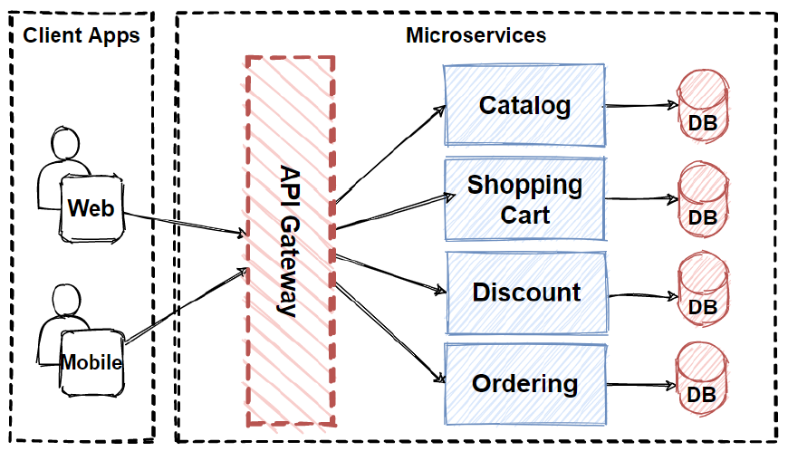
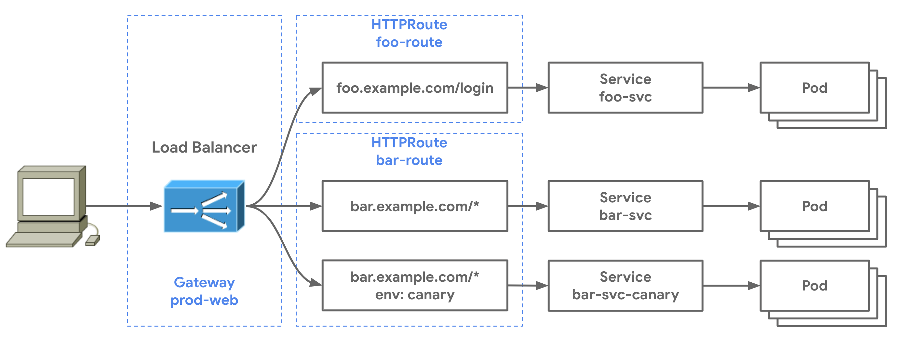
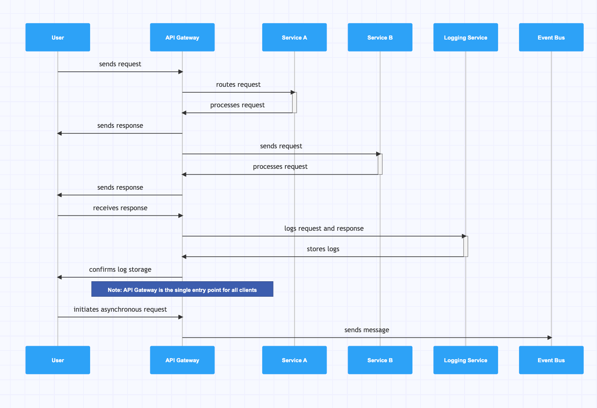

# 0.9. Trabajo Individual - Patrones Cloud (Informes y Videos)
- [Volver al índice](/0/0.md)

## Integrantes 01: Rodrigo De los Ríos
Escriban su desarollo.

# Patrón Gateway Routing

## Índice
- [Introducción](#introducción)
- [¿Qué es el Patrón Gateway Routing?](#qué-es-el-patrón-gateway-routing)
- [Problema que Resuelve](#problema-que-resuelve)
- [Arquitectura del Patrón](#arquitectura-del-patrón)
- [Componentes Principales](#componentes-principales)
- [Implementación](#implementación)
- [Casos de Uso](#casos-de-uso)
- [Ventajas y Desventajas](#ventajas-y-desventajas)
- [Demo del Código](#demo-del-código)
- [Mejores Prácticas](#mejores-prácticas)
- [Referencias](#referencias)

## Introducción

El patrón **Gateway Routing** es un patrón de diseño arquitectónico que permite dirigir las solicitudes de los clientes hacia diferentes servicios backend basándose en el contenido de la solicitud. Este patrón es especialmente útil en arquitecturas de microservicios donde múltiples servicios necesitan ser accesibles a través de un único punto de entrada.



## ¿Qué es el Patrón Gateway Routing?

El Gateway Routing actúa como un proxy reverso inteligente que examina las solicitudes entrantes y las dirige al servicio backend apropiado basándose en criterios predefinidos como:

- **Ruta URL**: `/api/users` → Servicio de Usuarios
- **Método HTTP**: GET, POST, PUT, DELETE
- **Headers**: Tipo de contenido, autenticación
- **Parámetros de consulta**: Versión de API, región
- **Carga útil**: Contenido del cuerpo de la solicitud



## Problema que Resuelve

### Desafíos Tradicionales:
- **Múltiples puntos de entrada**: Los clientes necesitan conocer las URLs específicas de cada servicio
- **Complejidad de configuración**: Cada cliente debe manejar diferentes endpoints
- **Falta de flexibilidad**: Cambios en la arquitectura backend requieren modificaciones en todos los clientes
- **Gestión de políticas**: Aplicar autenticación, autorización y rate limiting en múltiples servicios

### Solución del Gateway Routing:
- **Punto de entrada único**: Un solo endpoint para todos los servicios
- **Enrutamiento inteligente**: Decisiones automáticas basadas en reglas
- **Abstracción de la complejidad**: Los clientes no necesitan conocer la arquitectura interna
- **Gestión centralizada**: Políticas aplicadas en un solo lugar

## Arquitectura del Patrón

La arquitectura del Gateway Routing se compone de varios elementos clave que trabajan en conjunto:

```
Cliente → Gateway Router → Servicio Backend Apropiado
```

### Flujo de Datos:
1. **Recepción**: El gateway recibe la solicitud del cliente
2. **Análisis**: Examina la solicitud (URL, headers, etc.)
3. **Decisión**: Aplica las reglas de enrutamiento
4. **Reenvío**: Dirige la solicitud al servicio backend correcto
5. **Respuesta**: Retorna la respuesta al cliente



## Componentes Principales

### 1. **Router Gateway**
- Componente central que recibe todas las solicitudes
- Contiene la lógica de enrutamiento
- Mantiene el mapeo de rutas a servicios

### 2. **Reglas de Enrutamiento**
- Configuración que define cómo dirigir las solicitudes
- Puede ser estática (archivos de configuración) o dinámica (base de datos)
- Incluye criterios de coincidencia y destinos

### 3. **Servicios Backend**
- Microservicios que procesan las solicitudes específicas
- Pueden estar en diferentes servidores o contenedores
- Independientes entre sí

### 4. **Balanceador de Carga (Opcional)**
- Distribuye la carga entre múltiples instancias del mismo servicio
- Mejora la disponibilidad y rendimiento


## Implementación

### Tecnologías Comunes:
- **API Gateways**: Kong, Zuul, Ocelot, AWS API Gateway
- **Proxies Reversos**: Nginx, HAProxy, Envoy
- **Frameworks**: Express.js con middleware personalizado, Spring Cloud Gateway

## Casos de Uso

### 1. **Arquitectura de Microservicios**
- Múltiples servicios independientes
- Necesidad de un punto de entrada unificado
- Diferentes tecnologías por servicio

### 2. **Versionado de APIs**
- Diferentes versiones de la misma API
- Migración gradual entre versiones
- Compatibilidad hacia atrás

### 3. **Segmentación por Región**
- Servicios específicos por ubicación geográfica
- Cumplimiento de regulaciones locales
- Optimización de latencia

### 4. **A/B Testing**
- Dirigir porcentajes de tráfico a diferentes versiones
- Pruebas de nuevas funcionalidades
- Análisis de rendimiento

## Ventajas y Desventajas

### **Ventajas:**
- **Simplicidad para el cliente**: Un solo punto de entrada
- **Flexibilidad**: Fácil modificación de rutas sin afectar clientes
- **Escalabilidad**: Agregar nuevos servicios transparentemente
- **Gestión centralizada**: Políticas y monitoreo en un lugar
- **Abstracción**: Los clientes no conocen la arquitectura interna

### **Desventajas:**
- **Punto único de falla**: Si el gateway falla, todos los servicios son inaccesibles
- **Complejidad adicional**: Necesidad de gestionar y mantener el gateway
- **Latencia**: Hop adicional en cada solicitud
- **Cuello de botella**: Posible limitación de rendimiento
- **Dependencia**: Todos los servicios dependen del gateway

## Demo del Código
El presente repositorio público contiene una implementación completa del patrón Gateway Routing que demuestra:
[enlace a github](https://github.com/RoudiOlding/gateway_routing_pattern.git)

## Diapositivas de exposición
Las diapositivas usadas para presentar el tema se encuentran también a su disposición en la carpeta '0.9/assets/exposicion_03_individual'.
[Enlace del dispositivo](./assets/exposicion_03_individual.pptx)

## Mejores Prácticas

### 1. **Diseño de Rutas**
- Usar convenciones RESTful consistentes
- Incluir versionado en las URLs (`/v1/api/users`)
- Evitar rutas demasiado específicas

### 2. **Gestión de Errores**
- Implementar timeouts apropiados
- Manejar errores de servicios downstream
- Proporcionar mensajes de error útiles

### 3. **Monitoreo y Logging**
- Registrar todas las solicitudes y respuestas
- Implementar métricas de rendimiento
- Alertas para servicios no disponibles

### 4. **Seguridad**
- Validar todas las solicitudes entrantes
- Implementar rate limiting
- Usar HTTPS en producción

### 5. **Rendimiento**
- Implementar caching cuando sea apropiado
- Optimizar las reglas de enrutamiento
- Considerar conexiones keep-alive

### 6. **Alta Disponibilidad**
- Implementar múltiples instancias del gateway
- Usar health checks para servicios backend
- Implementar circuit breakers

## Referencias

### Documentación Oficial:
- [Microsoft Azure - Gateway Routing Pattern](https://learn.microsoft.com/en-us/azure/architecture/patterns/gateway-routing)
- [AWS API Gateway Documentation](https://docs.aws.amazon.com/apigateway/)
- [Kong Gateway Documentation](https://docs.konghq.com/)

### Artículos y Recursos:
- [Microservices Patterns by Chris Richardson](https://microservices.io/patterns/apigateway.html)
- [Building Microservices by Sam Newman](https://samnewman.io/books/building_microservices/)
- [API Gateway Pattern - Martin Fowler](https://martinfowler.com/articles/gateway-pattern.html)

### Herramientas y Frameworks:
- [Nginx](https://nginx.org/en/docs/)
- [HAProxy](https://www.haproxy.org/)
- [Envoy Proxy](https://www.envoyproxy.io/)
- [Spring Cloud Gateway](https://spring.io/projects/spring-cloud-gateway)
- [Ocelot (.NET)](https://github.com/ThreeMammals/Ocelot)

### Repositorios de Ejemplo:
- [Netflix Zuul Examples](https://github.com/Netflix/zuul)
- [Kong Gateway Examples](https://github.com/Kong/kong)
- [Microservices Demo Projects](https://github.com/microservices-demo)

---

## Integrantes 02: Adrián Duarte
Escriban su desarollo.

## Integrantes 03: Alejandro Chávez
# Patrón Cloud Circuit Breaker
El patrón Cloud Circuit Breaker es una adaptación del patrón Circuit Breaker aplicado en entornos de computación en la nube y microservicios. Su objetivo principal es manejar fallos en servicios distribuidos, evitando que un sistema colapse debido a errores en cascada cuando un servicio remoto falla o está saturado, aumentando la estabilidad del sistema y su resiliencia a errores. 

## Problema
En sistemas distribuidos y aplicaciones en la nube, los servicios suelen comunicarse entre sí mediante llamadas remotas. Sin embargo, estos servicios pueden fallar debido a los siguientes eventos:

- Latencia elevada: Un servicio puede responder lentamente debido a sobrecarga.
- Fallas temporales: Errores en bases de datos, timeouts o indisponibilidad de recursos.
- Cascada de errores: Si un servicio dependiente falla, puede propagar el error a otros componentes, degradando el sistema completo.

Generando problemas como:

- Mayor consumo de recursos mientras se reintentan llamadas fallidas.
- Experiencia de usuario degradada debido a tiempos de espera prolongados.
- Posibles colapsos en sistemas críticos.

## Solución
El patrón Circuit Breaker actúa como un intermediario entre el cliente y el servicio, monitoreando las fallas. El comportamiento de este patrón es similar a un cortacircuito eléctrico con tres estados:

- Cerrado: Las solicitudes fluyen normalmente al servicio.
- Abierto: Si el servicio falla repetidamente, el circuito se abre y las solicitudes se desvían.
- Medio Abierto: Después de un tiempo, permite algunas solicitudes para probar si el servicio se recuperó.

### Complemento con otras plataformas
- Netflix Hystrix popularizó este patrón en microservicios.
- Resilience4j y Polly son alternativas modernas.
- En AWS, AWS Lambda puede usar Step Functions con manejo de errores similar.

### Casos de aplicación

#### Sector Financiero
En bancos y pasarelas de pago, los servicios de autorización de transacciones suelen depender de sistemas externos. Si un procesador de pagos comienza a fallar debido a sobrecarga, reintentos continuos podrían saturar el sistema o generar cobros duplicados. Implementar Circuit Breaker permite detectar fallos rápidamente y activar un fallback, como almacenar transacciones en una cola para reprocesamiento posterior. Esto evita cascadas de errores y mejora la confiabilidad, tal como hace PayPal durante eventos de alta demanda.

#### E-Commerce y Retail
Plataformas como Amazon o startups de comercio electrónico dependen de servicios de recomendación en tiempo real. Si un sistema de IA que sugiere productos empieza a responder lentamente, el Circuit Breaker puede desviar las peticiones a un caché de "productos populares" después de superar un umbral de timeouts. Así, aunque las recomendaciones sean menos personalizadas, la página carga rápidamente, evitando pérdidas de ventas. Netflix emplea un enfoque similar para garantizar que los usuarios siempre tengan contenido disponible, incluso si fallan los algoritmos de recomendación.

#### Telecomunicaciones y Logística
Aplicaciones de delivery necesitan geolocalización precisa para rastrear repartidores. Si la API de mapas falla, el Circuit Breaker evita reintentos innecesarios y activa un fallback: mostrar la última ubicación conocida o cambiar a un mapa offline. Esto mantiene la funcionalidad básica sin interrumpir el servicio. Uber aplica esta técnica en su sistema de rutas para manejar fallos temporales sin afectar a conductores y pasajeros.

### Aplicación al trabajo en grupo
El patron cloud Circuit Breaker puede ser de gran utilidad para nuestro proyecto Singletone. Como cualquier plataforma dependiente de servicios web, nuestros usuarios estan constantemente enviando solicitudes a los componentes del sistema. En caso uno de estos componentes falle al comunicarse con otros, se puede dar una inestabilidad en el servicio causada por los constantes intentos de comunicación. El patrón propuesto puede mejorar este tipo de casos, si bien no va a evitar los errores de conexión, si puede evitar que estos saturen el sistema causando bajadas en el rendimiento.

## Demo

### Caso
Un servicio de backend que proporciona datos críticos para una aplicación web. El servicio tiene problemas intermitentes debido a alta carga con una tasa de fallos del 50%. Se necesita evitar que los fallos del servicio afecten toda la aplicación

#### Problemas:
- Fallos repetidos del servicio saturan el cliente
- Tiempos de respuesta excesivos cuando el servicio está sobrecargado
- Posibilidad de fallos en cascada en todo el sistema

#### Solucion:
Implementar el patrón Circuit Breaker para detectar fallos constantes y bloquear temporalmente las solicitudes entrantes para evitar caidas completas en el sistema debido a la sobresaturación.

### Demo:
https://github.com/AleGCC/arqui-demo-CircuitBreaker

### Video:
https://youtu.be/emFXqc6Vdxw


## Integrantes 04: Angel Alcalá
Escriban su desarollo.

# Patrón Caché Aside

## Problema

Cuando una aplicación necesita datos, esta resulta costoso en términos de tiempo y recursos ya que las consultas requeridas de lectura son básicamente
las mismos datos, pero esto lo hace de forma repetida. En conjunto, esto ocasiona una alta latencia en las respuestas y sobrecarga el servidor de base de datos, y si estamos hablando de un sistema de alta demanda, existirá una escalabilidad limitada.

## Solución

El patrón Cache-Aside es una estrategia para gestionar almacenamiento de caché
para mejorar el rendimiento del sistema.
Cuando una aplicación necesita data, primero necesita revisar el caché. Si los datos son encontrados (acierto de caché o cache hit), es usado directamente. 
Si los datos no son encontrados (falla de caché), la aplicación lo recupera
desde la principal base de datos, almacena una copia en el caché para uso futuro y postreriormente, usa los datos obtenidos.

Este patrón reduce la carga de la base de datos, aumenta la velocidad del acceso de datos, y es ampliamente usado para mejorar la eficiencia y escalabilidad de aplicaciones asegurándose frecuentemente que los datos accedidos estén rápidamente disponibles.

Este patron también es conocido en inglés como **Lazy Loading** o carga diferida

## ¿Cómo logra mejorar la perfomance?

- **Acceso rápido a datos:** Accediendo a los datos de la memoria (caché) es significativamente rápido que recuperándola desde un almacenamiento basado en discos (base de datos)
- **Reduce la carga de la base de datos:** Al desviar una porción significativa de las solicitudes de lectura hacia el caché, el patron disminuye el núnero de consultas directas hacia la base de datos.
- **Escalabilidad:** Como la demanda del sistema se incrementa, el caché puede 
manejar un largo volumen de solicitudes de lectura sin poner tensión adicional a la base de datos.
- **Rendimiento mejorado:** Al descargar las tareas de recuperación hacia el caché, la base de datos es libre para manejar otras operaciones.
- **Disminuye latencia:** El patron disminuye la latencia asociada con la recuperación de datos al servir datos en caché.

## Casos de aplicación

### Netflix

Una de las grandes empresas de streaming a nivel mundial, necesita una gestión eficiente para su amplio catálogo de películas y shows
de TV, asegurando un acceso rápido a la metadata y recomendar contenidos. Por ello, usan **EVCache**, una implementación personalizada construida sobre MEmcached, para almacenar en caché datos a los que se acceden con frecuencia.

### Amazon

Amazon aprovecha el patrón Cache-Aside para optimizar la recuperación de datos del producto y de la gestión de los datos del inventorio a través de su plataforma e-commerce. Para ello, usan una combinación de una solución de caché en memoria como Redis y DynamoDB Accelerator (DAX) para detalles del producto en caché y los datos de inventarios.

### Facebook

Facebook usa este patrón para gestionar los datos de la sesión del usuario y datos de gráficos de frecuencia de acceso social como perfiles de usuario y lista de amigos. Para este caso usan una combinación de Memached y TAO (almacenamiento de datos distribuidos geográficamente) para los datos de sesioens en caché e información gráfica social.

## Demo

### Caso

Una aplicación de comercio electrónico necesita mostrar el precio de un producto en su página web. Este dato está en una base de datos SQL, pero leerlo frecuentemente desde allí genera una carga alta y tiempos de respuesta lentos.

### Problemas dados

- Las consultas frecuentes a la base de datos causan latencia y sobrecarga
- Muchos productos no cambian de precio con frecuencia, por lo que se hace lecturas innecesarias a la base de datos.

### Solución 

Usar el patron Cache-Aside para agilizar las consultas y como resultado, el rendimiento del sistema.

#### Pasos Previos

##### Docker Desktop

Primero se debe instalar Docker Desktop en este enlace: https://www.docker.com/products/docker-desktop/

##### Visual Studio Code

Para ejecutar el código en cuestión, previamente es necesario instalar VSCode
para poder correr, por ello se debe descargar en este enlace: https://code.visualstudio.com/download

#### Despliegue de Redis en Docker

Una vez en Docker Desktop, se debe ir a la barra de búsqueda y buscar redis, luego presionar run y configurar de la siguiente forma:

```
Container name: redis-demo
Puertos: 6379
```

Con ello, el contenedor de redis estará listo.

#### Configuraciones en VSCode

Una vez instalado VSCode, se debe configurar un entorno virtual como medida de
precaución. Por ello es necesario abrir la terminal y correr el siguiente comando:

```terminal
python -m venv demo       
```
Con ello, se crea el entorno virtual llamado **demo**

Ahora, debemos crear la carpeta del entorno virtual ingresando el siguiente comando a la terminal:

```terminal
demo\Scripts\activate    
```

Finalmente, nos aparecerá un paréntesis con letras verdes, lo cual nos indica que estamos dentro de nuestro entorno virtual. En este paso es necesario instalar redis en nuestro entorno virtual para que el código funcione.

```terminal
pip install redis   
```
#### Código

Para probar el patrón Cache-Aside, vamos a usar un código en python que buscará optimizar la base de datos y las consultas. Para ello, usará las consultas usando Redis, el cual está corriendo en Docker. Lo que hará el código es obtener el precio de un producto desde Redis, y si no está, lo busca en una base de datos simulada y luego lo guarda en Redis para futuras consultas.

```python
import redis
import time

# Simulación de base de datos
fake_db = {
    "product:1": {"price": 99.99},
    "product:2": {"price": 149.99},
}

# Conexión a Redis
cache = redis.Redis(host='localhost', port=6379, decode_responses=True)

def get_product_price(product_id):
    key = f"product:{product_id}:price"

    # 1. Intentar obtener de la caché
    cached_price = cache.get(key)
    if cached_price:
        print(f"✅ Cache hit para {product_id}: S/{cached_price}")
        return float(cached_price)

    # 2. Si no está en la caché, buscar en "base de datos"
    print(f"❌ Cache miss para {product_id}")
    product_data = fake_db.get(f"product:{product_id}")
    
    if product_data:
        price = product_data["price"]

        # 3. Guardar en caché (expira en 10 segundos)
        cache.setex(key, 10, price)
        print(f"📥 Guardado en caché: {key} -> S/{price}")
        return price

    print(f"⚠️ Producto {product_id} no encontrado.")
    return None

# DEMO de uso
for _ in range(3):
    print("Precio del producto 1:", get_product_price(1))
    time.sleep(3)

```

**Enlace a la demo:** https://www.youtube.com/watch?v=plIYDE_K8K0

## Referencias

https://www.geeksforgeeks.org/system-design/cache-aside-pattern


## Integrantes 05: Erick Valderrama
Escriban su desarollo.