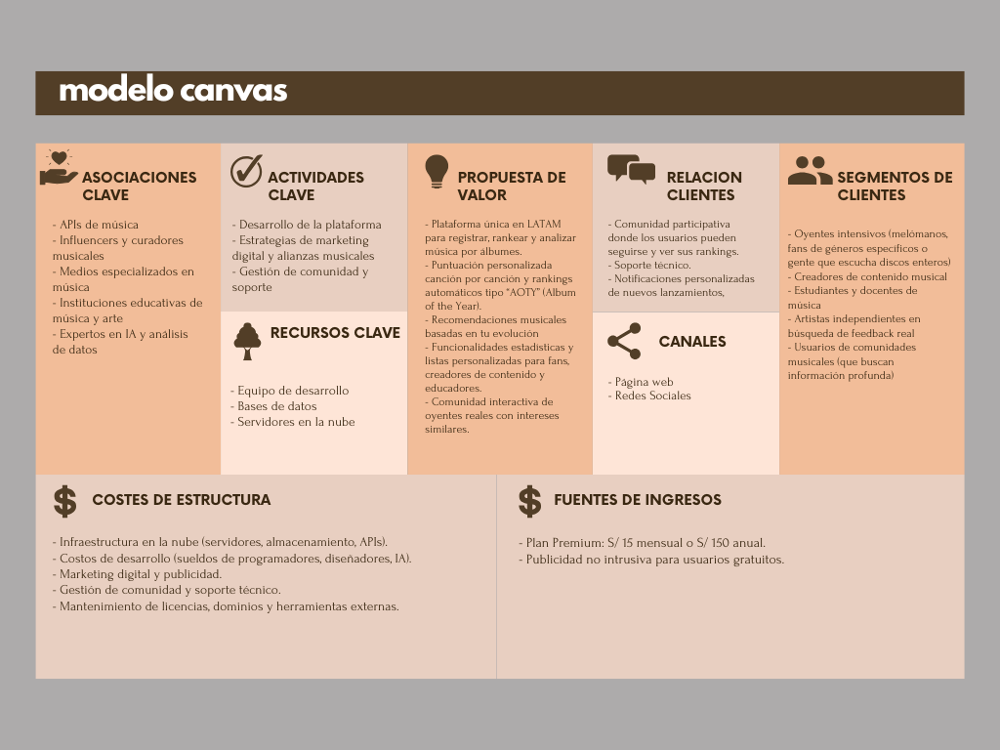

# 1.2. Modelo de Negocio

### 1. Freemium con funciones premium (modelo SaaS B2C)

Los usuarios pueden usar SingleTone de forma gratuita, pero con acceso limitado a ciertas funcionalidades avanzadas. Este modelo permite generar ingresos mientras se construye comunidad y retención.

#### Gratis:
- Registro de 7 albums
- Vista en perfil: carrusel de top albums (ordenado por nota), carrusel de top artistas (en base al ponderado de sus albums) y lista de albums valorados recientemente

#### Premium (S/ 5 mensual):
- Rankings ilimitados por año y artista
- Recomendaciones semanales
- Vistas en el perfil extra: género, año de escucha, año de salida, aoty y clase del 1-5
- Distintivo como socio dentro del perfil

## 2. CANVAS
A continuación se muestra el desarrollo del modelo:

