# 2.1. Requerimientos Funcionales
- [Volver al índice](/2/2.md)

- Enlace Figma: [(sketch / wireframe / mockup): ](https://www.figma.com/design/ryXvWuesD9qPFPVfbQLlAh/SingleTone?node-id=1-39&t=K5GfAyUDsLmBBYSh-1)
- Enlace Figma (prototipo — interactivo): { https://www.figma.com/proto/ryXvWuesD9qPFPVfbQLlAh/SingleTone?page-id=2264%3A2236&node-id=2264-2237&viewport=-2213%2C686%2C0.55&t=bXhgbd1v6AtPWr0E-1&scaling=scale-down-width&content-scaling=fixed&starting-point-node-id=2264%3A2237 } 

### Módulo 1: Gestión de Usuarios

| ID   | Nombre                             | Historia de Usuario                                                                                                                                                     |
|------|------------------------------------|--------------------------------------------------------------------------------------------------------------------------------------------------------------------------|
| RF1  | Registro de usuario                | Como usuario, quiero poder registrarme en la plataforma completando un formulario con mis datos personales, para crear mi cuenta y empezar a usar Singletone.             |
| RF2  | Validación de correo y nickname    | Como usuario, quiero que el sistema me avise si mi correo o nickname ya están registrados, para poder corregirlos y completar mi registro sin inconvenientes.            |
| RF3  | Inicio de sesión                   | Como usuario, quiero poder iniciar sesión usando mi correo o nickname y mi contraseña, para acceder de forma segura a mi cuenta en cualquier momento.                    |
| RF4  | Visualización de tipo de cuenta    | Como usuario, quiero que el sistema reconozca si mi cuenta es gratuita o premium al iniciar sesión, para tener claridad sobre las funciones disponibles.                  |
| RF5  | Seguridad en mis datos             | Como usuario, quiero que mis datos personales y mi contraseña estén protegidos, para sentir confianza en el uso de la plataforma y en el manejo de mi información.        |
| RF6  | Activación de cuenta premium       | Como usuario que selecciona el plan premium, quiero ser dirigido automáticamente al sistema de pagos, para poder completar mi suscripción antes de usar la plataforma.    |

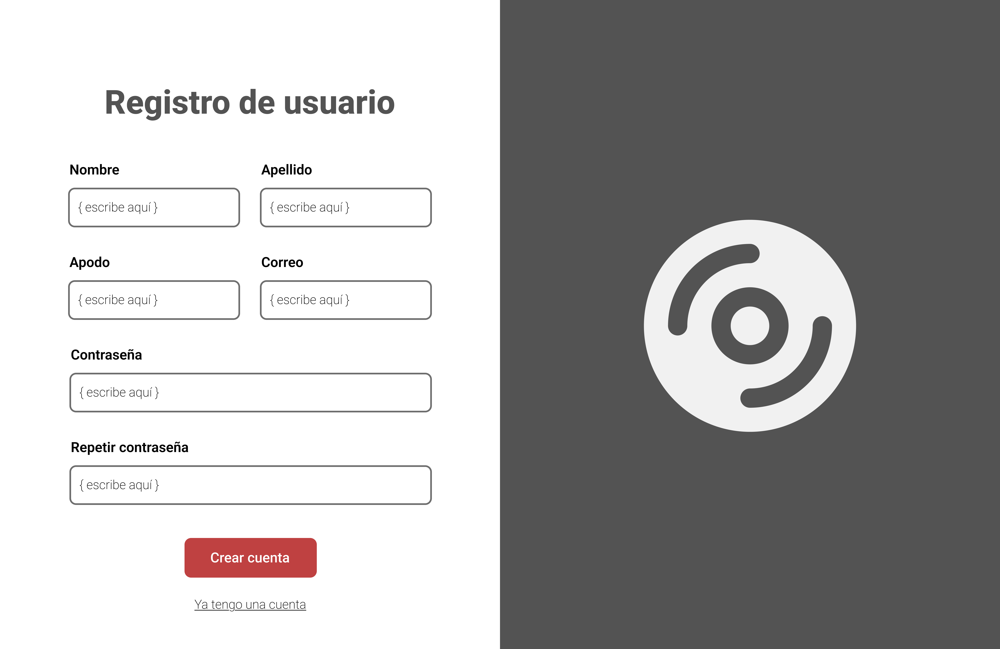
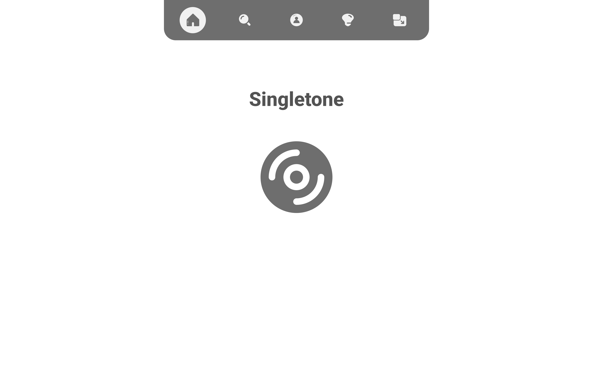

### Módulo 2: Visualización de Perfiles

| ID   | Nombre                                     | Historia de Usuario                                                                                                                                                              |
|------|--------------------------------------------|-----------------------------------------------------------------------------------------------------------------------------------------------------------------------------------|
| RF7  | Visualización de datos básicos             | Como usuario, quiero poder ver mi foto, nombre y tipo de suscripción en mi perfil, para tener claridad sobre mi identidad y el estado de mi cuenta en la plataforma.             |
| RF8  | Indicador de límite de valoraciones        | Como usuario con cuenta gratuita, quiero ver cuántas valoraciones semanales me quedan, para administrar mejor mis interacciones musicales.                                      |
| RF9  | Estadísticas personales                    | Como usuario, quiero visualizar estadísticas como la cantidad de artistas y álbumes que he valorado, para llevar un seguimiento de mi actividad musical.                        |
| RF10 | Biblioteca musical en el perfil            | Como usuario, quiero ver mis artistas y álbumes agregados en carruseles ordenados por ponderado, para acceder fácilmente a mis contenidos más relevantes.                        |
| RF11 | Acceso a todos los artistas                | Como usuario, quiero acceder a una página con todos mis artistas en biblioteca, divididos entre los valorados y los que aún faltan por valorar, para organizar mejor mi avance. |
| RF12 | Acceso a todos los álbumes                 | Como usuario, quiero acceder a una página con todos mis álbumes agregados, filtrables por estado o ranking, para explorar mi colección de forma más ordenada.                   |
| RF13 | Edición de perfil                          | Como usuario, quiero poder editar mi foto, nombre, apellido y contraseña, para mantener mi perfil actualizado y seguro.                                                         |
| RF14 | Listas adicionales para usuarios premium   | Como usuario premium, quiero acceder a listas ordenadas por género, año de valoración, año de salida y mejor álbum del año actual, para explorar mi biblioteca de formas más diversas.  |

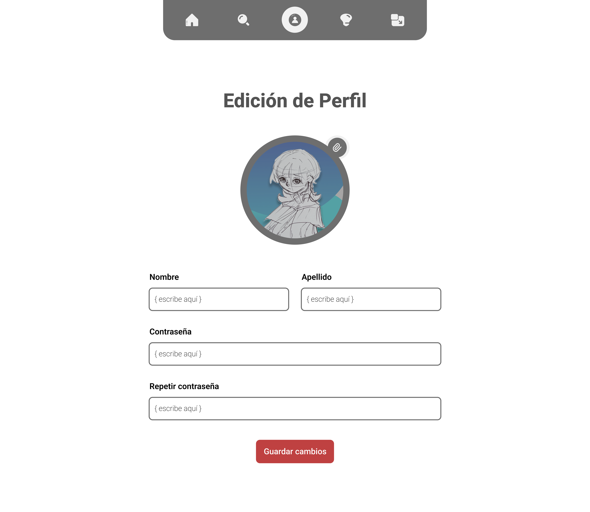

### Módulo 3: Exploración Musical

| ID   | Nombre                                   | Historia de Usuario                                                                                                                                                             |
|------|------------------------------------------|----------------------------------------------------------------------------------------------------------------------------------------------------------------------------------|
| RF15 | Búsqueda general con filtros             | Como usuario, quiero buscar contenido usando filtros por tipo (álbum, artista, usuario), para encontrar más fácilmente lo que me interesa dentro de la plataforma.              |
| RF16 | Visualización de resultados por pestañas | Como usuario, quiero que los resultados de búsqueda estén organizados por tipo en pestañas, para navegar entre artistas, álbumes y usuarios de forma clara y rápida.           |
| RF17 | Vista detallada de álbum                 | Como usuario, quiero poder acceder a una página con detalles del álbum, como portada, año y canciones, para decidir si quiero añadirlo a mi biblioteca.                        |
| RF18 | Vista detallada de artista               | Como usuario, quiero acceder al perfil de un artista para ver sus álbumes ordenados por año y decidir si quiero añadirlo a mi biblioteca, para explorar mejor su discografía.                    |
| RF19 | Vista detallada de usuario               | Como usuario, quiero ver el perfil de otro usuario con su foto, estadísticas y contenidos valorados, para conocer mejor sus gustos y referencias musicales.                    |

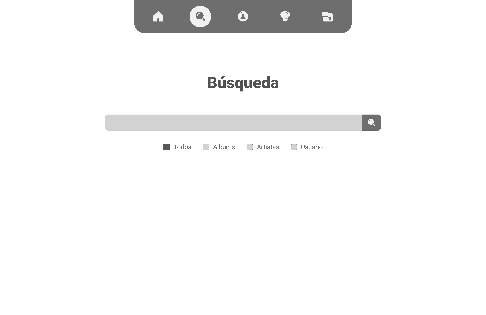

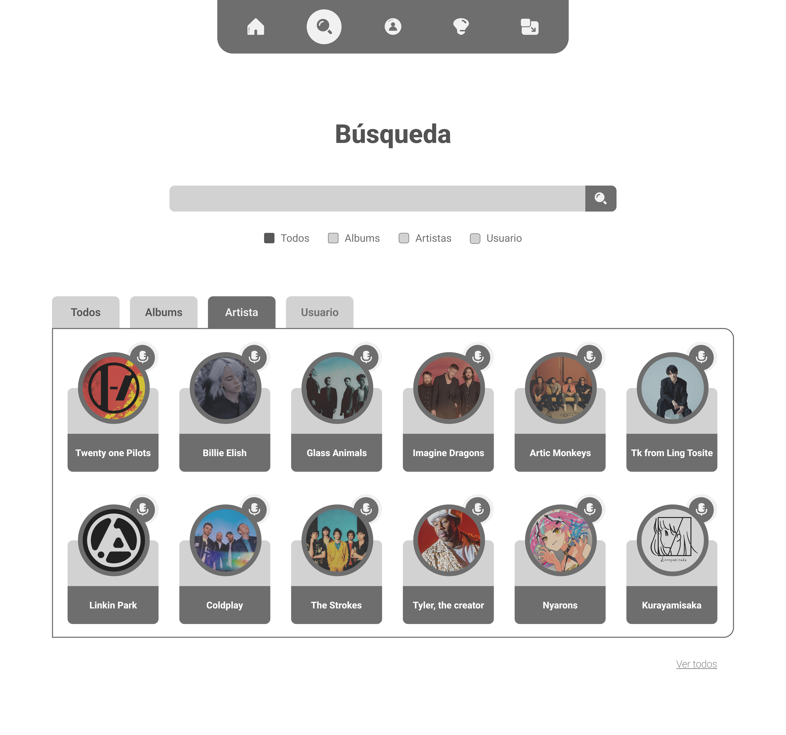
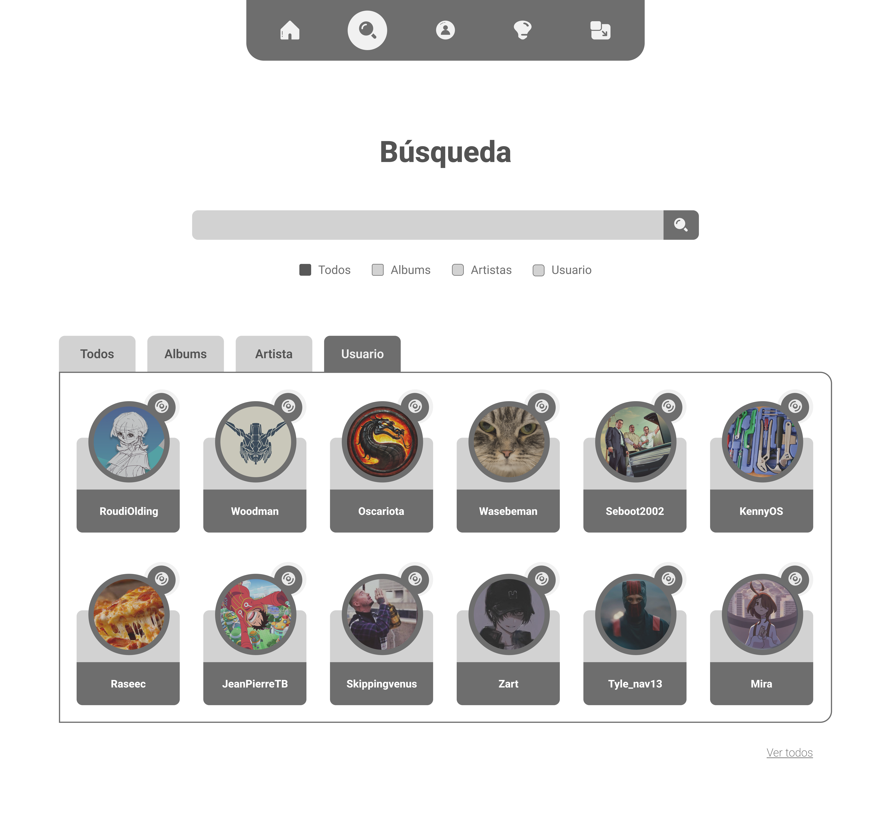

### Módulo 4: Gestión de Bibilioteca

| ID   | Nombre                                      | Historia de Usuario                                                                                                                                                                     |
|------|---------------------------------------------|------------------------------------------------------------------------------------------------------------------------------------------------------------------------------------------|
| RF20 | Eliminar artistas y álbumes                | Como usuario, quiero eliminar artistas o álbumes de mi biblioteca, para mantener organizada solo la música que me interesa conservar.                                                   |
| RF21 | Eliminación en cascada de álbumes          | Como usuario, quiero que al eliminar un artista se eliminen automáticamente sus álbumes asociados, para no dejar registros aislados en mi biblioteca.                                  |
| RF22 | Estados de artistas y álbumes              | Como usuario, quiero que los artistas y álbumes reflejen si ya han sido completamente valorados o no, para saber mi progreso en la gestión de mi biblioteca musical.                   |
| RF23 | Valoración de canciones                    | Como usuario, quiero asignar puntuaciones individuales a cada canción de un álbum, para dejar una valoración detallada según mis preferencias.                                         |
| RF24 | Límite de valoraciones semanales           | Como usuario con cuenta gratuita, quiero tener claro que solo puedo hacer hasta 50 valoraciones semanales, para gestionar mis valoraciones sin exceder el límite.                         |
| RF25 | Guardado de valoración completa            | Como usuario, quiero guardar la valoración de un álbum solo cuando haya puntuado todas sus canciones, para asegurarme de que el álbum está completamente evaluado.                     |
| RF26 | Guardado como borrador                     | Como usuario, quiero guardar el progreso de una valoración parcial como borrador, para retomarla después sin perder mi avance.                                                         |
| RF27 | Reevaluación de canciones                  | Como usuario, quiero poder reevaluar cualquier canción cuando lo desee, para actualizar mis valoraciones sin alterar la fecha original del álbum.                                      |
| RF28 | Notificación de valoraciones restantes     | Como usuario con cuenta gratuita, quiero ser notificado cuando me queden 40, 30, 20, 10 o 0 valoraciones semanales, para saber cuántas oportunidades me quedan.                         |
| RF29 | Valoraciones ilimitadas para Premium       | Como usuario premium, quiero poder valorar canciones sin ninguna limitación semanal, para explorar y valorar toda mi biblioteca sin restricciones.                                     |
| RF30 | Vistas adicionales para el plan Premium       | Como usuario premium, quiero contar con vistas adicionales de album (AOTY, año valorado y año de salida), para contar con un nivel de detalle mayor en el orden de mi bibilioteca musical   |

###  Módulo 5: Gestión de Recomendaciones

| ID   | Nombre                                         | Historia de Usuario                                                                                                                                                                      |
|------|------------------------------------------------|-------------------------------------------------------------------------------------------------------------------------------------------------------------------------------------------|
| RF31 | Recomendaciones personalizadas                | Como usuario premium, quiero recibir recomendaciones basadas en mis álbumes mejor valorados y mis géneros preferidos, para descubrir música que esté alineada con mis gustos.           |
| RF32 | Sección destacada en el header                | Como usuario premium, quiero ver un apartado de recomendaciones en el encabezado, para acceder rápidamente a nuevas sugerencias musicales.                                               |
| RF33 | Mostrar artista y álbumes sugeridos           | Como usuario premium, quiero que se me recomiende un artista junto con tres álbumes relevantes, para explorar nuevas propuestas de forma concreta.                                       |
| RF34 | Recomendación automatizada                    | Como usuario premium, quiero que las recomendaciones se generen automáticamente a partir de mis valoraciones previas, para recibir sugerencias adaptadas a mi perfil musical.           |
| RF35 | Botón de volver a recomendar                  | Como usuario premium, quiero poder solicitar nuevas recomendaciones en caso las actuales no me convencen, para recibir alternativas más afines a mis gustos.                                    |

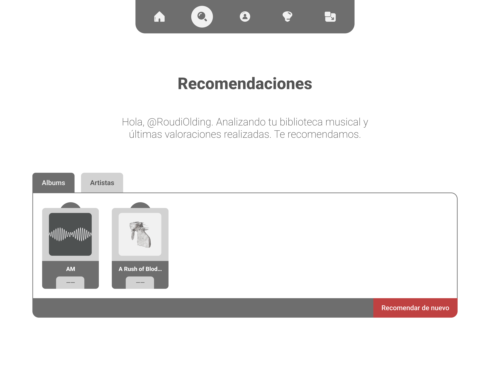
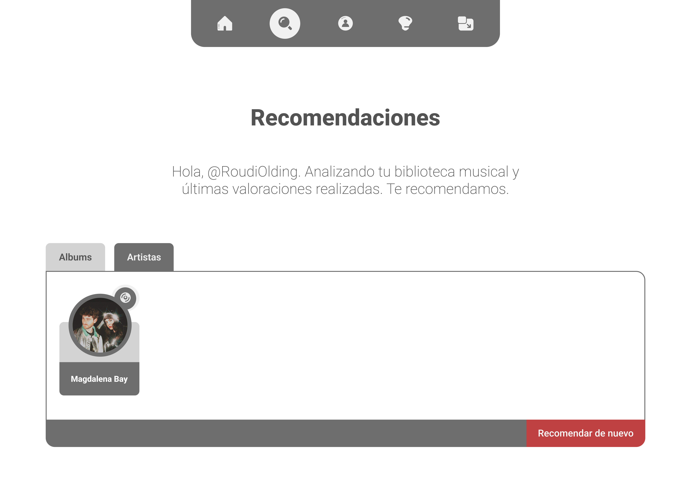

###  Módulo 6: Gestión de Planes y Monetización

| ID   | Nombre                                           | Historia de Usuario                                                                                                                                                                 |
|------|--------------------------------------------------|--------------------------------------------------------------------------------------------------------------------------------------------------------------------------------------|
| RF36 | Acceso a página de incentivo premium             | Como usuario, quiero poder acceder fácilmente a la página que informa sobre los beneficios de ser premium, desde mi perfil o luego de crear mi cuenta, para considerar una mejora. |
| RF37 | Selección de duración y método de pago           | Como usuario, quiero seleccionar la duración de mi plan premium y registrar los datos de mi tarjeta, para completar la suscripción según mis posibilidades.                        |
| RF38 | Activación de funcionalidades premium            | Como usuario, quiero que el sistema verifique mi tipo de cuenta y active las funciones correspondientes, para aprovechar los beneficios del plan que contraté.                      |
| RF39 | Distintivo visual de cuenta premium              | Como usuario premium, quiero tener un título especial debajo de mi nombre de perfil, para reflejar mi suscripción y destacar mi estatus.                                            |
| RF40 | Fecha de vencimiento visible al hacer hover      | Como usuario premium, quiero ver la fecha de vencimiento de mi plan al pasar el cursor sobre el distintivo, para estar informado de la duración restante de mi suscripción.         |

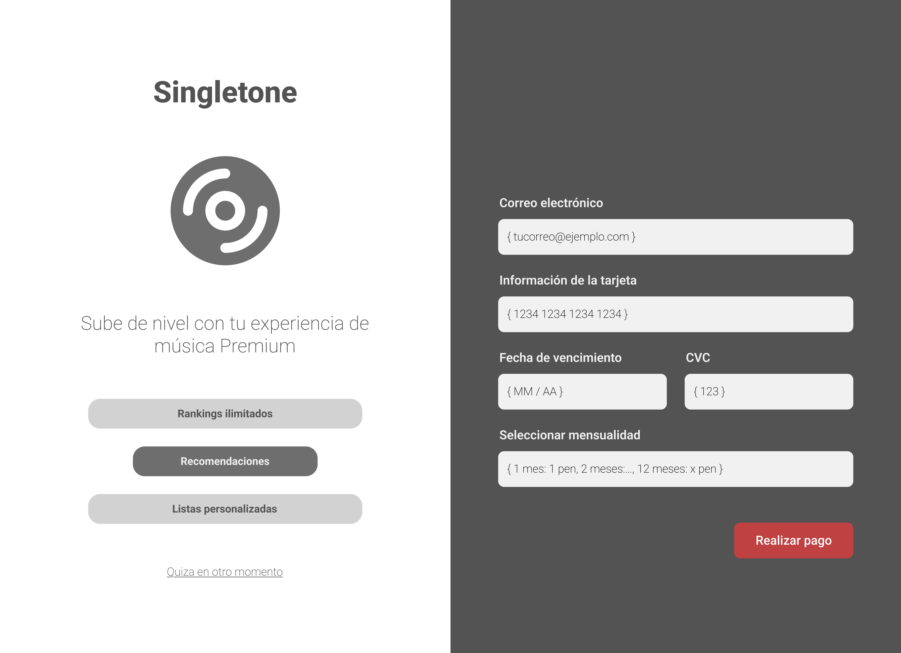
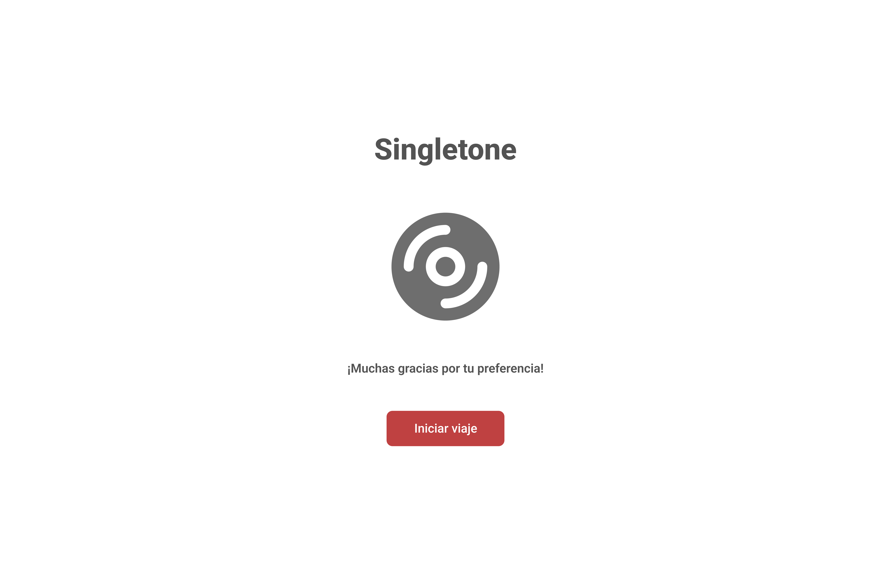

Las siguientes vistas pertencen a los distintivos del usuario premium así como las listas adicionales para visualizar los albums.

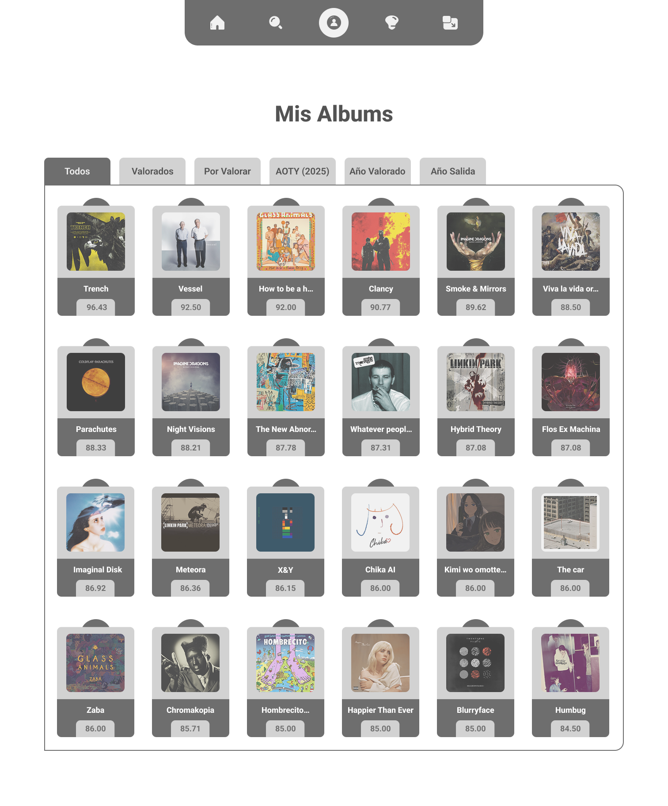