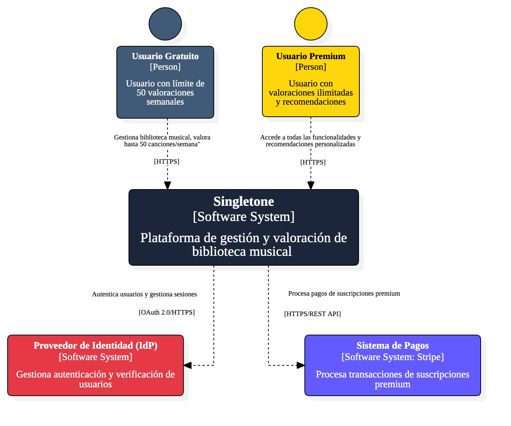

# 5.1. Contexto
- [Volver al índice](/6/6.md)

A continuación, se muestra el diagram de contexto del aplicativo web SINGLETONE:

## Actores

- **Usuarios Gratuito**: Usuario con límite de 10 valoraciones mensuales.
- **Usuarios Premium**: Usuario con valoraciones ilimitadas y recomendaciones.

## Sistema Central

- **Singletone**: Plataforma de gestión y valoración de biblioteca musical.

## Sistemas Externos

- **Sistema de Pagos**: Procesa transacciones de suscripciones premium.
- **Proveedor de Identidad**: Gestiona autenticación y verificación de usuarios.
