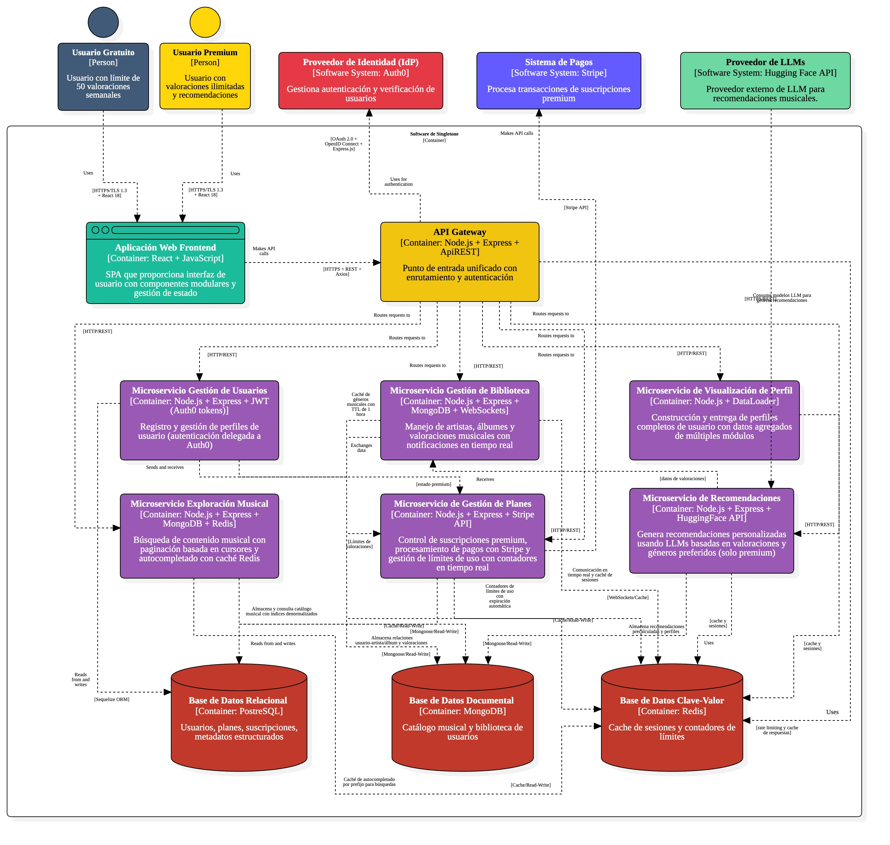

# 5.2. Contenedores
- [Volver al índice](/6/6.md)

El presente diagrama representa una arquitectura de microservicios para software Singletone. Aquí está una descripción detallada de los componentes:

## Usuarios

- **Usuarios Gratuito**: Usuario con límite de 10 valoraciones mensuales.
- **Usuarios Premium**: Usuario con valoraciones ilimitadas y recomendaciones.

## Aplicación Web Frontend

- Desarrollado con React y Javascript.
- Interfaz principal para los usuarios.

## API Gateway

- Punto de entrada unificado con enrutamiento y autenticación.

## Microservicios

- **Gestión de usuarios**: Registro, autenticación y perfiles de usuario.
- **Visualización de perfil**: Maneja visualización de datos del perfil, estadísticas y carruseles de contenido musical.
- **Exploración musical**: Búsqueda y descubrimiento de contenido musical.
- **Gestión de biblioteca**: Manejo de artistas, álbumes y valoraciones musicales.
- **Gestión de recomendaciones**: Uso de LLMs para sugerencias personalizadas.
- **Gestión de planes**: Control de suscripciones y límites de uso.

## Bases de Datos

- **MongoDB**: Catálogo musical y biblioteca de usuarios.
- **PostgreSQL**: Datos estructurados de usuarios, planes y transacciones.
- **Redis**: Cache de sesiones y contadores de límites.

## Sistemas Externos

- **Sistema de Pagos**: Procesa transacciones de suscripciones premium.
- **Proveedor de Identidad**: Gestiona autenticación y verificación de usuarios.