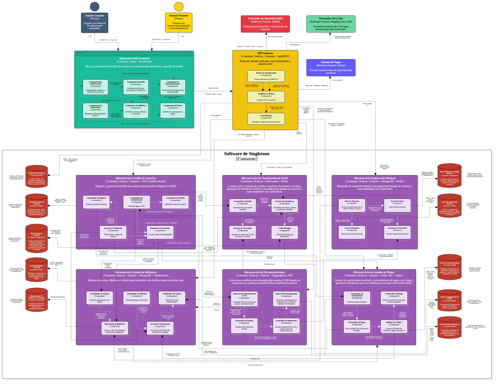

# 5.3. Componentes
- [Volver al índice](/6/6.md)

Finalizando con lo establecido por el marco de diseño C4, se presenetará el desarrollo del diagrama de componentes para el software Singletone. El mismo tomó en cuenta lo establecido por el diagrama de contenedores, lo expande e ingresa detalles mediante los sub componentes y relaciones entre los artefactos.

## Componentes Principales
- **Usuario Gratuito (Freemium)**: Usuario con funciones básicas de interacción, consumo limitado.
- **Usuario Premium (Premium)**: Usuario con capacidades avanzadas y experiencia completa.
- **Proveedor de Identidad (IdP)**: Sistema de autenticación y verificación de usuarios.
- **Sistema de Pagos**: Procesa transacciones de suscripciones y pagos.
- **Provedor de LLMs**: Dispone los modelos usados para las recomendaciones musicales de álbumes y artistas.

## Aplicación Web Frontend
**SPA web proporciona interfaz de usuario web para componentes y gestión de estado**
- **Componente de Autenticación**: Maneja login, registro y validación de usuarios.
- **Componente de Perfil**: Visualización de datos personales y estadísticas.
- **Componente de Recomendaciones**: Visualización de sugerencias personalizadas.
- **Componente de Exploración**: Búsqueda y descubrimiento musical.
- **Componente de Biblioteca**: Gestión de artistas, álbumes y canciones.
- **Componente de Planes**: Gestión de suscripciones y pagos.

## API Gateway
**Portal de entrada unificado con enrutamiento y autorización**
- **Rutas de Autenticación**: Gestión de rutas de acceso y verificación.
- **Validador de Tokens**: Verificación de tokens de acceso y permisos.
- **Load Balancer**: Distribución equilibrada de cargas entre servicios.

## Microservicios

### Microservicio Gestión de Usuarios
**Registros, perfiles, preferencias y gestión de usuarios**
- **Controlador de Registro**: Maneja creación de cuentas.
- **Controlador de Autenticación**: Gestiona login y JWT.
- **Controlador de Perfiles**: Administra datos de usuario.
- **Servicio de Validación**: Valida datos y reglas de negocio.
- **Repositorio de Usuarios**: Acceso a datos de PostgreSQL.

### Microservicio Visualización de Perfil
**Manejo y visualización de datos del perfil, metadatos y contenido musical**
- **Controlador de Perfil**: Orquesta datos del perfil completo.
- **Servicio de Estadísticas**: Contabiliza de albums, artistas y canciones añadidos.
- **Servicio de Carruseles**: Gestiona el component visual de albums y artistas.
- **Caché Manager**: Administra Redis para rendimiento.

### Microservicio Exploración Musical
**Búsqueda y descubrimiento de contenido musical**
- **Motor de búsqueda**: Procesa consultas musicales de albums, artistas y usuarios.
- **Servicio de filtros**: Aplica filtros avanzados.
- **Caché de Búsquedas**: Redis para consultas frecuentes.
- **Controlador de resultados**: Formatea respuestas de búsqueda.

### Microservicio Gestión de Biblioteca
**Manejo de listas, álbumes y valoraciones musicales**
- **Controlador de Artistas**: Gestiona operaciones con artistas.
- **Controlador de Albumes**: Maneja álbumes y canciones.
- **Notificador de Límites**: WebSockets para notificaciones.
- **Repositorio de Biblioteca**: Acceso a datos de biblioteca musical por MongoDB.
- **Servicio de Valoraciones**: Procesa la valoración del tracklist de un álbum.

### Microservicio de Recomendaciones
**Genera recomendaciones personalizadas basadas en valoraciones y preferencias musicales**
- **Cliente de Recomendaciones LLM**: Consume APIs de LLMs para generar recomendaciones.
- **Caché de Recomendaciones**: Almacena recomendaciones generadas por LLM para optimizar rendimiento.
- **Procesador de Perfiles**: Analiza preferencias de usuario.
- **Generador de Sugerencias**: Procesa respuestas de LLM y genera listas de recomendaciones.

### Microservicio de Gestión de Planes
**Control de suscripciones y límites de uso**
- **Controlador de Suscripciones**: Gestiona planes premium.
- **Notificador Premium**: Sistema de notificaciones para usuarios premium.
- **Procesador de Pagos**: Procesamiento de información de pagos.
- **Monitor de Límites**: Control de límites de valoración según suscripción.

## Almacenamiento de Datos

### Base de Datos Relacional
**Usuarios, planes, suscripciones, metadatos estructurados**

### Base de Datos Documental
**Catálogo musical, biblioteca de usuarios**

### Base de Datos Clave-Valor
**Caché de sesiones y configuraciones de límites**

## Software de Singleton
Sistema de contenedores que gestiona la comunicación y orquestación entre todos los componentes del sistema.

## Comunicación
- Los microservicios se comunican entre sí a través de HTTP/HTTPS
- **API Gateway** enruta las solicitudes a los microservicios apropiados según la funcionalidad requerida
- Los sistemas de base de datos se integran con microservicios específicos según el tipo de datos
- El sistema utiliza caché distribuido para optimizar el rendimiento

## Patrón de Arquitectura
El diagrama muestra una arquitectura de microservicios especializada en gestión de contenido musical con clara separación de responsabilidades. Cada microservicio maneja un dominio específico (usuarios, contenido, biblioteca, recomendaciones, playlists) con sus propias bases de datos especializadas, promoviendo un acoplamiento flexible y escalabilidad independiente. La arquitectura soporta tanto usuarios gratuitos como premium con diferentes niveles de acceso y funcionalidades.