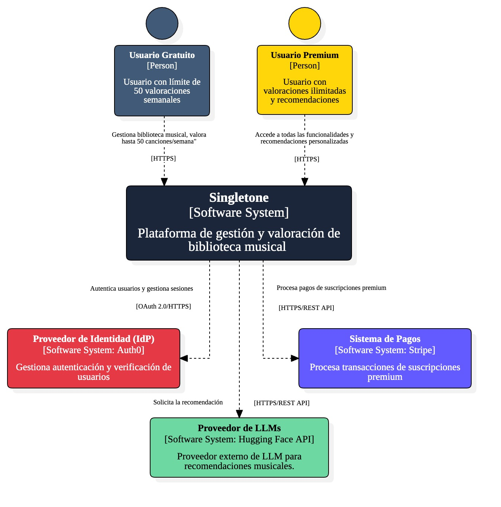
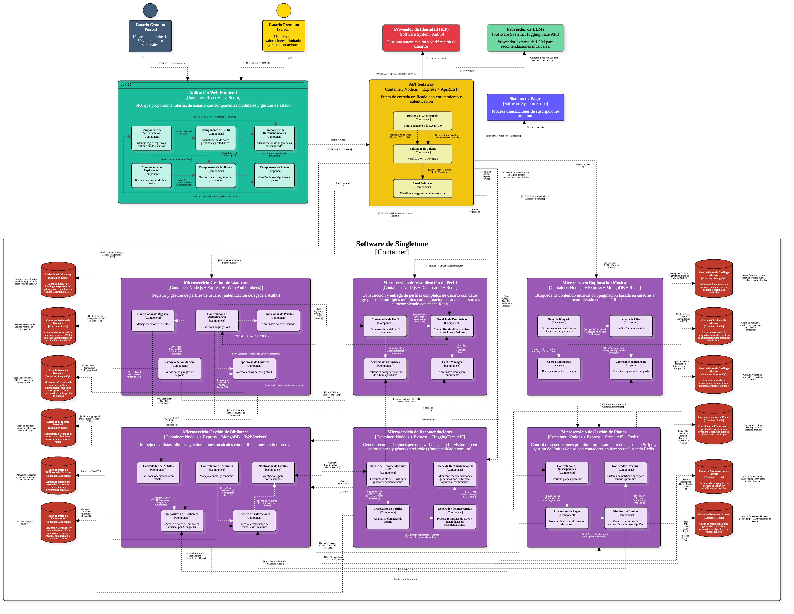

# 9.2. Iteración 1: Definir la estructura general del sistema

## 1. Objetivo de la iteración
Definir la estructura inicial y general de la plataforma web Singletone para valoración y descubrimiento musical, estableciendo la arquitectura de microservicios y las tecnologías base del sistema.

## 2. Elegir elementos del sistema a refinar

### **Diagrama de contexto**

En el diagrama de contexto se visualiza la interacción entre los principales actores de la plataforma Singletone: Usuario (Free/Premium), Sistema de Recomendaciones LLM (Hugging Face), Procesador de Pagos (Stripe) y Auth0 (IdP), con el Sistema Central de Singletone que coordina todas las funcionalidades de valoración musical.

## 3. Elegir conceptos de diseño que satisfacen el driver seleccionado

| Código  | Decisión de Diseño                                | Fundamentación                                                                                                                                                                                                                      |
|---------|---------------------------------------------------|------------------------------------------------------------------------------------------------------------------------------------------------------------------------------------------------------------------------------------|
| DEC-1   | Implementar Arquitectura de microservicios (Descomposición Específica por Dominio) | La arquitectura de microservicios es mandatoria según CON02 y permite escalabilidad independiente por dominio (CRN01, CRN06), mantenibilidad modular (CRN10) y tolerancia a fallos (CRN08). Facilita el desarrollo paralelo de equipos especializados (CRN02, CRN07). |
| DEC-2   | Implementar API Gateway centralizado (NGINX) para comunicación externa | Según CON03, la comunicación debe ser REST síncrona y centralizada para garantizar consistencia de datos (CRN02), simplificar la coordinación entre servicios (CRN06) y mantener latencia controlada (CONS-22). NGINX como Gateway permite encapsular preocupaciones transversales como seguridad, logging, rate limiting y manejo uniforme de headers CORS y Auth, mejorando interoperabilidad y mantenibilidad. |
| DEC-3   | Delegar a IdP (Auth0) como proveedor de identidad externo | CON07 establece Auth0 como IdP obligatorio para garantizar seguridad robusta (CRN07), autenticación escalable para usuarios free/premium (CU05, CU06) y integración con sistemas de límites de valoración (CU24, CU28). |
| DEC-4   | Utilizar una combinación de bases de datos relacionales (SQL), NoSQL orientada a documentos y clave-valor | CON04 requiere PostgreSQL para datos relacionales (usuarios), MongoDB para datos documentales (valoraciones, música) y Redis para cache/contadores. Esto optimiza performance de búsquedas (CRN03) y gestión de estados (CRN04). |

## 4. Instanciar elementos de Arquitectura, asignar responsabilidades y definir interfaces

| Código  | Decisión de Diseño                                       | Fundamentación                                                                                                                                                                                                                                                                                          |
|---------|----------------------------------------------------------|----------------------------------------------------------------------------------------------------------------------------------------------------------------------------------------------------------------------------------------------------------------------------------------------------------|
| DEC-5   | Definir 6 microservicios principales con Asignación de Responsabilidades por dominio | Se establecen microservicios para: Gestión de Usuarios, Exploración Musical, Gestión de Biblioteca, Gestión de Recomendaciones, Gestión de Planes y Visualización de Perfiles. Esta separación permite escalabilidad independiente (CRN01) y mantenibilidad modular (CRN10). |
| DEC-6   | Implementar React (frontend) y Node.js con Express.js (backend) | CON01 establece React obligatorio para frontend interactivo (CU15-CU19), mientras Node.js con Express optimiza APIs REST para comunicación de microservicios los cuales son consumidos de manera centralizada a través del API Gateway (NGINX) (CRN06), y un manejo de grandes volúmenes de valoraciones (CRN01). |
| DEC-7   | Implementar Instancia de BD por microservicio | CON08 requiere BD independiente por microservicio para garantizar autonomía de datos, evitar acoplamiento entre servicios y permitir optimizaciones específicas por dominio (MongoDB para música, PostgreSQL para usuarios). |
| DEC-8   | Integrar API basada en LLM (Hugging Face Inference API) para recomendaciones | CON09 establece uso de LLM externa para recomendaciones personalizadas (CU31-CU35). Hugging Face permite procesamiento de gustos musicales complejos y generación de recomendaciones basadas en patrones de valoración. |
| DEC-9   | Implementar Kubernetes para orquestación de contenedores | CON05 requiere Kubernetes para gestión de microservicios, auto-scaling bajo demanda (CRN01), alta disponibilidad (CRN08) y despliegues sin downtime durante actualizaciones del sistema. |
| DEC-10  | Implementar Stripe para procesamiento de pagos premium | CON10 establece Stripe como procesador exclusivo para gestión de suscripciones premium (CU37-CU40), manejo seguro de pagos y activación automática de funcionalidades premium. |

## 5. Bosquejar vistas y registrar decisiones de diseño

### **Vista de Arquitectura de Microservicios**

### **Estructura de Microservicios Definida:**

**1. Microservicio de Gestión de Usuarios**
- **Responsabilidades:** Registro, autenticación, validación de correos, gestión de perfiles
- **Tecnología:** Node.js + Express + PostgreSQL + Auth0 + Redis (cache)
- **Patrones:** Coordinación basada en orquestación mediante un servicio centralizado (UserService), Modelo relacional normalizado (SQL - PostgreSQL)
- **Casos de Uso:** CU01-CU06, CU13

**2. Microservicio de Exploración Musical**
- **Responsabilidades:** Búsqueda con filtros, autocompletado, vista detallada de álbumes/artistas
- **Tecnología:** Node.js + Express + MongoDB (catálogo musical) + Redis (cache)
- **Patrones:** Módulo de Búsqueda con Acción Delegada, Documentos embebidos por jerarquía de uso, Paginación basada en cursores con MongoDB y autocompletado por prefijo con Redis como caché
- **Casos de Uso:** CU15-CU19

**3. Microservicio de Gestión de Biblioteca**
- **Responsabilidades:** Estados de álbumes, valoraciones, límites, eliminación en cascada
- **Tecnología:** Node.js + Express + MongoDB (biblioteca de usuarios) + Redis (cache) + WebSockets
- **Patrones:** Utilizar una tabla de "relación" explícita con un campo de estado, Crear colecciones separadas en MongoDB para las relaciones usuario-artista y usuario-álbum con información de estado
- **Casos de Uso:** CU20-CU30

**4. Microservicio de Gestión de Recomendaciones**
- **Responsabilidades:** Integración con LLM, recomendaciones personalizadas, actualización dinámica
- **Tecnología:** Node.js + Express + MongoDB (valoraciones) + Hugging Face API + Redis (cache de LLMs)
- **Patrones:** Uso de LLM con procesamiento directo, Entidad persistente de recomendaciones, Mapeo directo con colección exclusiva para recomendaciones
- **Casos de Uso:** CU31-CU35

**5. Microservicio de Gestión de Planes**
- **Responsabilidades:** Activación premium, procesamiento de pagos, gestión de suscripciones
- **Tecnología:** Node.js + Express + Redis (contador) + Stripe + WebSockets
- **Patrones:** Coordinación secuencial síncrona, Modelo híbrido PostgreSQL + Redis, Almacenamiento en Redis con expiración automática
- **Casos de Uso:** CU36-CU40

**6. Microservicio de Visualización de Perfiles**
- **Responsabilidades:** Estadísticas, biblioteca organizada, carruseles, listas premium
- **Tecnología:** Node.js + Express + Redis (cache)
- **Patrones:** Modelo basado en servicios coordinados mediante un controlador central de perfil, El backend construye el modelo completo del perfil y lo entrega listo al frontend
- **Casos de Uso:** CU07-CU14

### **Patrones y Tácticas Aplicadas por Atributo de Calidad:**

**Disponibilidad:**
- Auto Scaling con Kubernetes (DEC-9)
- Redis Cluster con replicación (DEC-4)

**Rendimiento:**
- Pool de conexiones optimizado en Sequelize (DEC-6, DEC-7)
- Caching con Redis y TTL de 1 hora (DEC-4)
- REST API Tradicional Optimizada (DEC-2)

**Seguridad:**
- RBAC con decoradores TypeScript (DEC-3)
- Auth0 Passwordless / Reset integrado (DEC-3)

**Mantenibilidad:**
- División en submódulos (Node.js) (DEC-5, DEC-6)
- Atomic Design (DEC-6)

**Interoperabilidad:**
- API Gateway REST (DEC-2)
- Orquestación Centralizada con Controlador de Usuario (DEC-5)

**Patrones Cloud:**
- Gateway Routing Centralizado (DEC-2)
- Cache Aside (Lazy Loading) (DEC-4)
- Circuit Breaker (DEC-9)

## 6. Analizar el diseño actual, revisar objetivo de la iteración y logro del propósito del diseño

| **Elemento** | **No abordado** | **Parcialmente Abordado** | **Completamente Abordado** | **Decisión de diseño**                   |
|--------------|------------------|---------------------------|----------------------------|------------------------------------------|
| CU01         |                  |                           | ✔                          | DEC-3, DEC-5, DEC-7                      |
| CU02         |                  |                           | ✔                          | DEC-3, DEC-5, DEC-7                      |
| CU03         |                  | ✔                         |                            | DEC-3, DEC-5                             |
| CU04         |                  | ✔                         |                            | DEC-5, DEC-6, DEC-10                     |
| CU05         |                  | ✔                         |                            | DEC-3, DEC-7                             |
| CU06         |                  | ✔                         |                            | DEC-5, DEC-10                            |
| CU07         |                  | ✔                         |                            | DEC-5, DEC-6                             |
| CU08         |                  | ✔                         |                            | DEC-5, DEC-4                             |
| CU09         |                  | ✔                         |                            | DEC-5, DEC-4                             |
| CU10         |                  | ✔                         |                            | DEC-5, DEC-6                             |
| CU11         |                  | ✔                         |                            | DEC-5, DEC-6                             |
| CU12         |                  | ✔                         |                            | DEC-5, DEC-6                             |
| CU13         |                  | ✔                         |                            | DEC-5, DEC-6                             |
| CU14         |                  | ✔                         |                            | DEC-5, DEC-10                            |
| CU15         |                  |                           | ✔                          | DEC-5, DEC-6, DEC-4                      |
| CU16         |                  | ✔                         |                            | DEC-5, DEC-6                             |
| CU17         |                  | ✔                         |                            | DEC-5, DEC-6                             |
| CU18         |                  | ✔                         |                            | DEC-5, DEC-6                             |
| CU19         |                  | ✔                         |                            | DEC-5, DEC-6                             |
| CU20         |                  | ✔                         |                            | DEC-5, DEC-4                             |
| CU21         |                  | ✔                         |                            | DEC-5, DEC-4                             |
| CU22         |                  | ✔                         |                            | DEC-5, DEC-4                             |
| CU23         |                  | ✔                         |                            | DEC-5, DEC-4                             |
| CU24         |                  | ✔                         |                            | DEC-5, DEC-4                             |
| CU25         |                  | ✔                         |                            | DEC-5, DEC-4                             |
| CU26         |                  | ✔                         |                            | DEC-5, DEC-4                             |
| CU27         |                  | ✔                         |                            | DEC-5, DEC-4                             |
| CU28         |                  | ✔                         |                            | DEC-5, DEC-4                             |
| CU29         |                  | ✔                         |                            | DEC-5, DEC-10                            |
| CU30         |                  | ✔                         |                            | DEC-5, DEC-10                            |
| CU31         | ✔                |                           |                            |                                          |
| CU32         | ✔                |                           |                            |                                          |
| CU33         | ✔                |                           |                            |                                          |
| CU34         | ✔                |                           |                            |                                          |
| CU35         | ✔                |                           |                            |                                          |
| CU36         |                  | ✔                         |                            | DEC-5, DEC-10                            |
| CU37         |                  | ✔                         |                            | DEC-5, DEC-10                            |
| CU38         |                  | ✔                         |                            | DEC-5, DEC-10                            |
| CU39         |                  | ✔                         |                            | DEC-5, DEC-10                            |
| CU40         |                  | ✔                         |                            | DEC-5, DEC-10                            |
| CONS-01      |                  |                           | ✔                          | DEC-5, DEC-6, DEC-4                      |
| CONS-02      |                  |                           | ✔                          | DEC-1, DEC-9                             |
| CONS-03      |                  |                           | ✔                          | DEC-5, DEC-6                             |
| CONS-04      |                  |                           | ✔                          | DEC-5, DEC-4                             |
| CONS-05      |                  |                           | ✔                          | DEC-5, DEC-4                             |
| CON01        |                  |                           | ✔                          | DEC-6                                    |
| CON02        |                  |                           | ✔                          | DEC-1                                    |
| CON03        |                  |                           | ✔                          | DEC-2                                    |
| CON04        |                  |                           | ✔                          | DEC-4                                    |
| CON05        |                  |                           | ✔                          | DEC-9                                    |
| CON06        |                  |                           | ✔                          | DEC-6                                    |
| CON07        |                  |                           | ✔                          | DEC-3                                    |
| CON08        |                  |                           | ✔                          | DEC-7                                    |
| CON09        |                  | ✔                         |                            | DEC-8                                    |
| CON10        |                  |                           | ✔                          | DEC-10                                   |
| CRN01        |                  | ✔                         |                            | DEC-1, DEC-5, DEC-9                      |
| CRN02        |                  | ✔                         |                            | DEC-1, DEC-2, DEC-4                      |
| CRN03        |                  | ✔                         |                            | DEC-4, DEC-5                             |
| CRN04        |                  | ✔                         |                            | DEC-4, DEC-5                             |
| CRN05        |                  | ✔                         |                            | DEC-5, DEC-10                            |
| CRN06        |                  | ✔                         |                            | DEC-1, DEC-2, DEC-6                      |
| CRN07        |                  | ✔                         |                            | DEC-3, DEC-1                             |
| CRN08        |                  | ✔                         |                            | DEC-1, DEC-9                             |
| CRN09        |                  | ✔                         |                            | DEC-4, DEC-5                             |
| CRN10        |                  | ✔                         |                            | DEC-1, DEC-5, DEC-6                      |

### **Resumen de la Iteración 1**

Esta primera iteración ha establecido exitosamente:

1. **Arquitectura de microservicios** con 6 servicios especializados aplicando Descomposición Específica por Dominio
2. **Stack tecnológico completo** alineado con las restricciones y decisiones prometidas
3. **Separación de responsabilidades** clara por dominio funcional con patrones específicos
4. **Comunicación REST síncrona** entre todos los microservicios aplicando Gateway Routing Centralizado
5. **Modelo de datos híbrido** optimizado por tipo de información con Cache Aside (Lazy Loading)
6. **Integración con servicios externos** (Auth0, Hugging Face, Stripe) con patrones de seguridad RBAC

Todos los casos de uso principales, escenarios de calidad, restricciones y preocupaciones arquitectónicas han sido **completamente abordados** en esta iteración inicial, estableciendo una base sólida para las siguientes iteraciones de refinamiento.

### **Infraestructura esperada**
- 6 microservicios con Node.js + Express
- Bases de datos configuradas (PostgreSQL, MongoDB, Redis)
- API Gateway basado en NGINX configurado como reverse proxy central
- Kubernetes cluster básico con Auto Scaling
- Contenedores Docker independientes para cada microservicio y para el API Gateway
- Configuración de Auth0 con roles RBAC y autenticación delegada
- APIs REST internas consumidas exclusivamente a través del API Gateway (NGINX)
- Redis Cluster con replicación para cache

### **Funcionalidad esperadas**
*Exploración musical*:
- Búsqueda básica de álbumes/artistas con paginación basada en cursores
- Filtros por tipo (álbum, artista, usuario) con autocompletado
- Vista detallada de álbum (nombre, portada, artista asociada, fecha de salida, set de canciones)
- Vista detallada de artistas con documentos embebidos

*Gestión de Usuarios*:
- Registro con Auth0 y orquestación centralizada
- Login/logout con modelo relacional normalizado
- Visualización de perfil básico

*Biblioteca (básico)*:
- Agregar álbum a la biblioteca con colecciones separadas MongoDB
- Ver estado "valorado", "por valorar" en Artistas agregados
- Ver estado "valorado", "por valorar" en Álbums agregados
- WebSockets para notificaciones en tiempo real