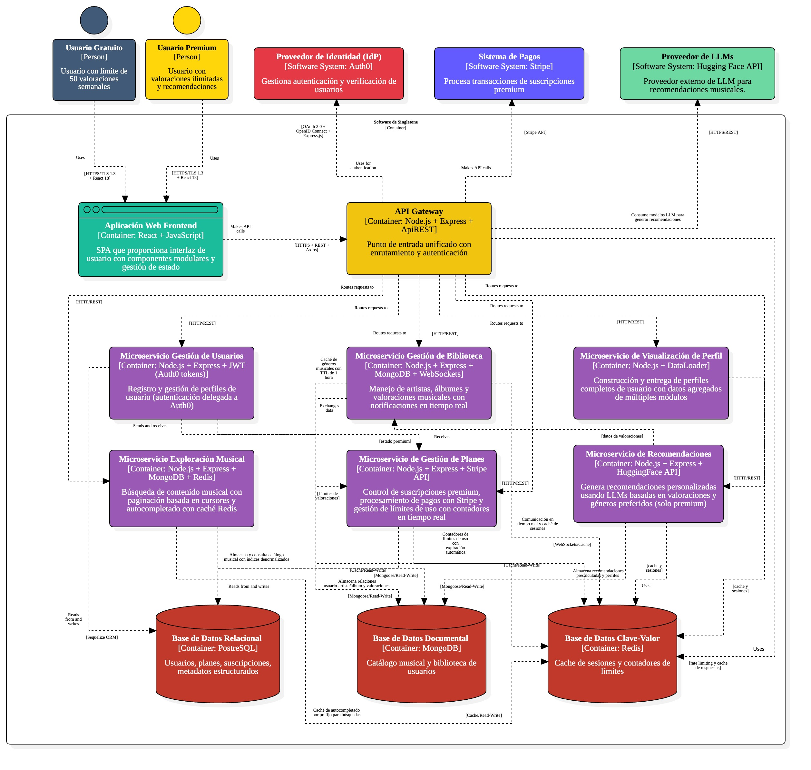
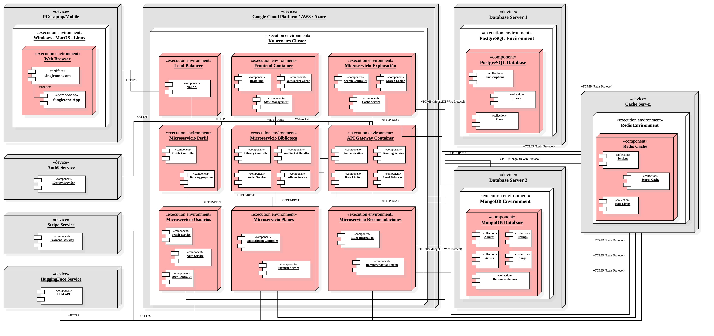

# 9.4. Iteración 3: Refinar estructuras para abordar el atributo de calidad más importante

### Paso 1: Revisar Entradas

| **Propósito de Diseño**                                      | **Funcionalidad Primaria**                                                                                               | **Escenarios de Calidad**                                                 | **Restricciones y Preocupaciones de Arquitectura**                                                    |
|---------------------------------------------------------------|--------------------------------------------------------------------------------------------------------------------------|----------------------------------------------------------------------------|--------------------------------------------------------------------------------------------------------|
| Refinar estructuras para abordar el atributo de calidad más importante | CU-01, CU-02, CU-03, CU-05, CU-06, CU-23, CU-25, CU-28, CU-36, CU-37, CU-38, CU-40                                       | CONS-03, CONS-07, CONS-10, CONS-24, CONS-27                                 | CON-01, CON-02, CON-03, CON-04, CON-07, CON-09, CON-10, CRN-01, CRN-06, CRN-07, CRN-10                 |

### Paso 2: Establecer objetivo de la iteración

El objetivo de esta iteración es fortalecer la seguridad del sistema Singletone en los puntos más sensibles: autenticación, autorización, encriptación de datos personales y comunicaciones externas, y protección de endpoints críticos como el de valoración, pagos y suscripciones. Se implementarán mecanismos robustos para proteger la integridad del sistema y la información del usuario frente a accesos indebidos, fugas de datos y vulnerabilidades externas.

### Paso 3: Elegir uno o más elementos del sistema a refinar

Los elementos seleccionados son:

- **Módulo de Gestión de Usuarios**, para asegurar la autenticación y validación de identidad.
- **Microservicio de Biblioteca**, para proteger las rutas de valoración y control de límites.
- **Microservicio de Planes**, por manejar pagos e información de suscripción.
- **Integraciones externas** (Auth0, Stripe, Hugging Face) que requieren control de acceso seguro y uso limitado de tokens.

### Paso 4: Elegir uno o más conceptos de diseño que satisfacen el driver seleccionado

| **Código** | **Decisión de Diseño**                                                                 | **Fundamentación**                                                                                                                                                                                                                      |
|------------|-----------------------------------------------------------------------------------------|-----------------------------------------------------------------------------------------------------------------------------------------------------------------------------------------------------------------------------------------|
| **DEC-43** | Middleware de validación JWT en todos los endpoints sensibles                           | Garantiza que solo usuarios autenticados accedan a rutas protegidas (valoración, perfil, suscripción). Usa el token de Auth0 con verificación local, cumpliendo CONS-07 y CRN-07.                                                      |
| **DEC-44** | Separación de roles Free/Premium con control RBAC a nivel de microservicio             | Implementación de lógica de roles explícita para limitar acciones según el tipo de cuenta. Protege funcionalidades avanzadas (CU28, CU29, CU38, CU40), evitando acceso indebido.                                                       |
| **DEC-45** | Encriptación de datos sensibles (valoraciones, estadísticas, suscripción)               | Se aplicará encriptación AES-256 en campos clave (preferencias musicales, historial de pago), tanto en tránsito como en reposo. Cubre CRN-07 y CONS-27.                                                                                |
| **DEC-46** | Sanitización y validación estricta de entradas del usuario                              | Prevención de ataques tipo injection en endpoints como búsqueda, valoración, login. Añade seguridad adicional a CU01, CU23 y CU25.                                                                                                     |
| **DEC-47** | Expiración y rotación automática de tokens con Auth0                                    | Configuración del ciclo de vida de tokens para limitar exposición prolongada. Se integra con OAuth2 y Auth0 Management API.                                                                                                            |
| **DEC-48** | Rate Limiting adaptativo para proteger rutas de uso frecuente (valoraciones, login)     | Prevención de abuso mediante Redis y tokens de uso. Limita peticiones por IP y por usuario en ventanas de tiempo móviles. Aplica a CONS-24 y CRN-01.                                                                                   |

### Paso 5: Instanciar elementos de arquitectura, asignar responsabilidades y definir interfaces

| **Código** | **Decisión de Diseño**                                                                 | **Fundamentación**                                                                                                                                                                               |
|------------|-----------------------------------------------------------------------------------------|--------------------------------------------------------------------------------------------------------------------------------------------------------------------------------------------------|
| **DEC-49** | Middleware centralizado de autenticación y autorización en Gateway NGINX               | Encapsula validaciones comunes en el gateway para evitar duplicación en microservicios. Inspecciona headers de autenticación y delega según rol o recurso solicitado.                                                                 |
| **DEC-50** | Módulo de Roles dentro del microservicio de Usuarios                                   | Controla desde el backend la lógica de upgrade/downgrade entre cuentas, visibilidad de vistas premium y control de acceso en endpoints.                                                                                                |
| **DEC-51** | Política de cifrado de campos sensibles en MongoDB y PostgreSQL                        | Implementación a nivel de modelo y almacenamiento, con claves gestionadas por entorno. Evita fugas de datos sensibles como métricas personales o pagos.                                                                               |
| **DEC-52** | Redis como almacén temporal para control de límite por IP + validación en Biblioteca   | Implementación de contadores TTL para limitar intentos excesivos de valoración, con mensajes de advertencia al usuario y bloqueo progresivo.                                                                                          |
| **DEC-53** | Sanitizador middleware en Express.js + schema de validación                            | Uso de Joi/Zod para validar cuerpo de solicitudes entrantes, headers, parámetros y prevenir cargas maliciosas.                                                                                                                         |

### Paso 6: Bosquejar vistas y registrar decisiones de diseño

#### Diagrama de contenedores

#### Diagrama de despliegue

### Paso 7: Revisión de objetivos

| **Elemento** | **No abordado** | **Parcialmente Abordado** | **Completamente Abordado** | **Decisión de diseño**              |
|--------------|------------------|---------------------------|----------------------------|-------------------------------------|
| CU01         |                  |                           | ✔                          | DEC-43, DEC-46, DEC-53              |
| CU02         |                  |                           | ✔                          | DEC-43, DEC-46                      |
| CU03         |                  |                           | ✔                          | DEC-43, DEC-46, DEC-48              |
| CU05         |                  |                           | ✔                          | DEC-45, DEC-47, DEC-51              |
| CU06         |                  |                           | ✔                          | DEC-44, DEC-50                      |
| CU23         |                  |                           | ✔                          | DEC-43, DEC-45, DEC-52              |
| CU25         |                  |                           | ✔                          | DEC-45, DEC-53                      |
| CU28         |                  |                           | ✔                          | DEC-48, DEC-52                      |
| CU36         |                  |                           | ✔                          | DEC-44, DEC-50                      |
| CU37         |                  |                           | ✔                          | DEC-44, DEC-50                      |
| CU38         |                  |                           | ✔                          | DEC-44, DEC-50                      |
| CU40         |                  |                           | ✔                          | DEC-44, DEC-50                      |
| CONS-03      |                  |                           | ✔                          | DEC-43, DEC-46                      |
| CONS-07      |                  |                           | ✔                          | DEC-43, DEC-47                      |
| CONS-10      |                  |                           | ✔                          | DEC-45, DEC-51                      |
| CONS-24      |                  |                           | ✔                          | DEC-48, DEC-52                      |
| CONS-27      |                  |                           | ✔                          | DEC-45, DEC-51                      |
| CRN-01       |                  |                           | ✔                          | DEC-48, DEC-52                      |
| CRN-06       |                  |                           | ✔                          | DEC-49, DEC-52                      |
| CRN-07       |                  |                           | ✔                          | DEC-43, DEC-45, DEC-47              |
| CRN-10       |                  |                           | ✔                          | DEC-43, DEC-44, DEC-51              |

### **Resumen de la Iteración 3**

Esta tercera iteración ha reforzado los mecanismos de **seguridad** en Singletone, priorizando la protección de los datos de usuario, la integridad de las valoraciones y la confidencialidad de las operaciones internas y externas. Las decisiones arquitectónicas tomadas en esta fase abordan múltiples capas del sistema: desde la validación de accesos hasta la protección de endpoints críticos y la resistencia ante abusos.

1. Se integró **Auth0 con RBAC** en el API Gateway, filtrando accesos a rutas sensibles según el rol del usuario (Free o Premium), y evitando acceso no autorizado a funcionalidades protegidas como estadísticas avanzadas o suscripciones.
2. Se activaron medidas de **validación y expiración de tokens JWT**, previniendo sesiones prolongadas o manipuladas.
3. Se protegieron los canales de comunicación entre microservicios con **HTTPS**, y se cifraron datos sensibles en reposo mediante **AES-256**.
4. Se implementó **rate limiting con Redis** para evitar abusos por parte de usuarios maliciosos o bots, aplicando límites sobre endpoints como login, valorar, y suscribirse.
5. Se añadió un sistema de **auditoría de acciones sensibles**, incluyendo creación de valoraciones, cambios de perfil y pagos, permitiendo trazabilidad en caso de incidentes.
6. Se incluyeron **pruebas de sanitización de inputs** y detección de patrones sospechosos, reduciendo la superficie de ataques como inyecciones o exploración de rutas.

Con estas mejoras, Singletone alcanza un nivel básico de **resiliencia ante amenazas comunes**, y sienta la base para asegurar tanto la experiencia del usuario como la continuidad del negocio.

### **Infraestructura esperada**
- API Gateway con validación de tokens y control de roles (Auth0 RBAC)
- Redis configurado como limitador de tráfico por IP y usuario (rate limiting)
- Canales HTTPS activos entre frontend, gateway y microservicios
- Cifrado AES-256 de datos sensibles en MongoDB (valoraciones, pagos)
- Módulo de auditoría persistente para eventos críticos
- Scripts automatizados para pruebas de sanitización y tokens inválidos

### **Funcionalidades implementadas**

*Seguridad de autenticación y autorización*:
- Validación estricta de tokens JWT en cada microservicio.
- Roles diferenciados Free/Premium gestionados desde Auth0.
- Expiración y rotación automática de tokens de acceso.

*Protección ante abusos y ataques*:
- Rate limiting por usuario e IP para mitigar ataques de fuerza bruta.
- Firewall lógico aplicado a rutas sensibles como `/suscribirse` o `/guardar-valoración`.

*Protección de datos en tránsito y reposo*:
- Canales HTTPS habilitados y certificados configurados en frontend y backend.
- Cifrado simétrico AES-256 de campos confidenciales (datos de perfil, preferencias, historial de pagos).

*Trazabilidad y auditoría*:
- Registro de todas las operaciones críticas en una bitácora interna por usuario, fecha y acción.
- Visualización básica disponible para administración futura.

Con esta iteración, Singletone queda preparado para incorporar servicios más complejos como pagos y recomendaciones, bajo una base de seguridad sólida.